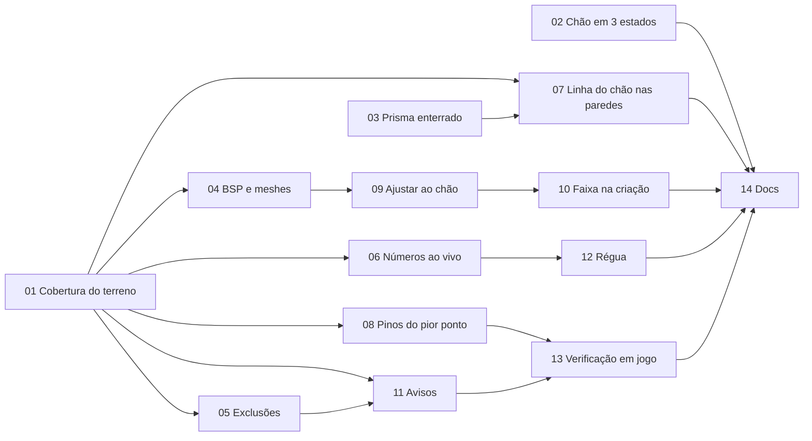

Status: ready-for-agent

# Cobertura vertical das zonas

## Problem Statement

Olhando o app, o usuário não consegue responder a 3 perguntas que decidem se uma zona funciona no servidor:

1. Quanto o piso (`zmin`) fica abaixo do chão e quanto o topo (`zmax`) fica acima dele.
2. Se todo o chão dentro do contorno cabe na faixa Z, ou se um morro fura o topo ou um vale passa por baixo do piso.
3. Onde fica o ponto que falha.

Um shape é um prisma: o servidor só considera um personagem dentro da zona quando o `x y` dele está no contorno **e** o `z` está entre `zmin` e `zmax`. Chão fora da faixa é chão fora da zona. O XML compila, o servidor carrega e o erro só aparece em jogo, quando alguém anda num trecho onde a zona não vale (sem PvP, sem paz, sem siege).

### Por que o app não mostra isso hoje

Estas causas foram lidas no código; não são suposições.

- **A sugestão de faixa só olha os vértices.** `zone.SuggestZRange` (`internal/zone/zone.go`) calcula a faixa a partir do Z dos pontos. Retângulo e círculo derrubam os vértices gerados no chão (`placed` e `groundZ`, em `cmd/zonebuilder/shapetool.go`), e o botão "Recalcular pelo chão" (`groundZRange`, em `cmd/zonebuilder/edittool.go`) procura o chão sob cada vértice. Nenhum dos 3 olha o chão **entre** os vértices. Um retângulo com os 4 cantos no vale e um morro no meio fica com o morro furando o topo, que é o que a captura de tela mostra.
- **O prisma esconde a parte enterrada.** `zoneOverlay.draw` (`internal/render/overlay.go`) desenha as faces com `GEQUAL` e sem escrever profundidade, então tudo que fica abaixo do terreno some. As arestas são desenhadas com o teste de profundidade desligado: a aresta do piso aparece por cima do morro, igual a uma aresta visível. Não há como o olho saber o que está enterrado e o quanto.
- **O modo Chão mostra pouco.** O shader `ground()` (`internal/render/ground.go`) pinta o chão que está dentro da faixa e hachura o que está fora, mas:
  - só funciona com o botão Chão ligado;
  - usa a mesma hachura para o chão acima do topo e para o chão abaixo do piso;
  - não mostra número nenhum: nem folga, nem área, nem o pior ponto.
- **Os painéis falam em Z absoluto.** A janela de altura mostra `piso z, topo z, altura`, e o inspetor mostra `zmin zmax` e a medida "No chão" (tamanho, área e perímetro em XY). Nada disso é relativo ao chão.
- `wholeTile` é a única ferramenta que considera a área, e faz isso de forma grosseira: usa `Scene.Bounds` do tile inteiro.

## Solution

Com uma zona selecionada, sem precisar ligar nada, o usuário vê:

- **Números**, por shape e para a zona inteira: o chão mais baixo e o mais alto sob o contorno, a folga do piso e a do topo, a área de chão dentro da faixa, acima do topo, abaixo do piso, sob exclusão e sem chão.
- **Viewport:**
  - chão acima do topo e chão abaixo do piso com cores diferentes;
  - linhas no chão onde ele cruza o piso e o topo;
  - em cada parede do prisma, a linha do chão e a parte enterrada visível através do terreno;
  - um pino no pior ponto, com a folga escrita.
- **Ação:** "Ajustar ao chão" passa a usar o chão da área inteira, e a criação de shapes sugere a faixa da mesma forma.
- **Ao vivo:** arrastar a seta Z ou mudar a faixa atualiza números e cores no mesmo frame.
- **Avisos:** o painel de problemas ganha avisos de chão fora da faixa. Eles não bloqueiam a compilação e levam ao pior ponto com um clique.

## Termos

| Termo | Definição |
| --- | --- |
| Chão | Superfície onde um personagem pode ficar: todo quad visível do terreno, mais as faces de BSP e de static mesh voltadas para cima (`normal.z ≥ 0,5`). Medido em coordenadas do servidor (`scene.ToServer`, ADR 0003). |
| Camada | Cada superfície de chão empilhada numa coluna `x y`: terreno, piso de prédio, ponte. |
| Perfil do chão (de um shape) | O chão recortado pelo contorno do shape: peças planas, extremos e o chão ao longo de cada aresta. Depende só do contorno e da cena, não da faixa. |
| Folga do piso | `chãoMin − zmin`. Negativa quando parte do chão está abaixo do piso. |
| Folga do topo | `zmax − chãoMax`. Negativa quando o chão fura o topo. |
| Cobertura | Fração da área de chão sob o contorno que fica dentro da faixa Z. |
| Sem chão | Área do contorno onde não há terreno (quad invisível, tile não carregado, fora do mapa). Não é medida e aparece como tal, nunca como coberta. |
| Pior ponto | O `x y z` do chão com a menor folga, separado para piso e para topo. |

## Implementation Decisions

### D1. Medição exata sobre os triângulos do chão, sem raios

Dentro de cada triângulo, a altura do chão varia de forma linear. Por isso, recortando os triângulos pelo contorno no plano XY:

- **Os extremos são exatos.** O chão mais alto e o mais baixo caem sempre num vértice de uma peça recortada, e a resolução não interfere: um pico de 1 unidade também conta.
- **As áreas são exatas.** Como `z` é afim em `x y`, a parte de uma peça acima de `zmax` é a peça recortada por um semiplano. O mesmo vale para `zmin`.

**Descartada:** amostrar com raios verticais (`Scene.Pick`) numa grade. Perde picos entre as amostras, custa um `pickTriangles` por raio (que percorre todos os `pickables`) e deixa o erro dependendo do passo da grade.

**De onde vêm os triângulos:**
- **Terreno:** as células da grade sob a caixa do contorno, com 2 triângulos por quad visível na diagonal de `EdgeTurn` (a mesma regra de `Terrain.cell`). As alturas saem de `Heights`, sem nenhum raio.
- **BSP e static meshes:** os `pickables` cuja caixa cruza a caixa do contorno, só os triângulos voltados para cima. A medição segue `World.HideMeshes`: com o botão Static meshes desligado, meshes não entram. O que se vê é o que se mede.

**Recorte:** o triângulo que tem os 3 vértices dentro do contorno e nenhuma aresta cruzando o contorno entra inteiro, que é o caso comum. Os demais passam por Sutherland–Hodgman, com o contorno (que pode ser côncavo) como polígono a recortar e o triângulo, que é convexo, como janela. Só as células ao longo do perímetro chegam a ser recortadas.

**Exclusões:** uma peça cujo centróide cai dentro de um shape banido, e na faixa Z dele, conta como "excluída", não como falha. O erro dessa regra fica limitado a 1 célula ao longo do contorno da exclusão. Recortar exclusões de forma exata exigiria diferença de polígonos, e não vale o custo.

**Coordenadas:** tudo sai em coordenadas do servidor, com `ToServer` aplicado a cada vértice, como o `Hit` do `Pick` já faz.

### D2. Separar o perfil (caro) da classificação (barata)

- **`Profile`** depende do contorno e da cena. É recalculado quando um vértice muda, quando um tile entra ou sai e quando `HideMeshes` muda. A chave segue o padrão de `groundKey`. O cálculo roda numa goroutine, como a carga de tiles, e o resultado chega ao loop de eventos por canal.
- **`Classify(zmin, zmax)`** depende só da faixa. Arrastar a seta Z ou digitar `zmin zmax` só reclassifica, no loop, no mesmo frame.
- **Orçamento:**
  - `Profile` de um tile inteiro: até 100 ms fora do loop. São cerca de 256 × 256 amostras, ou seja, uns 130 mil triângulos de terreno, mais BSP e meshes.
  - `Classify`: até 2 ms no loop.
  - Se `Classify` passar de 2 ms, o `Profile` passa a guardar uma tabela da área de chão acumulada por Z, com 1 entrada por unidade de Z entre `chãoMin` e `chãoMax`. Assim `Classify` vira 2 consultas na tabela. A decisão sai da medição com `-fps`, não antes dela.
- Enquanto um `Profile` está sendo calculado, a UI mostra o anterior com a marca "medindo…", nunca números de outro contorno.

### D3. Onde fica o código

| Lugar | Responsabilidade |
| --- | --- |
| `internal/scene` | `World.Floor(box, fn)`: entrega os triângulos de chão que cruzam `box`, em coordenadas do servidor, com a `Surface` de cada um. Fica na cena porque só ela conhece `EdgeTurn`, `QuadVisibility`, os `pickables` e `HideMeshes`. |
| `internal/coverage` (novo) | `Measure(floor Floor, shape Outline, bans []Ban) Profile` e `Profile.Classify(zmin, zmax) Report`. Sem GL e sem Gio. `Floor` é uma interface de 1 método, implementada por `scene.World`, para que os testes usem um chão sintético. |
| `cmd/zonebuilder/coverage.go` (novo) | Cache por chave, goroutine e entrega do relatório ao renderer, ao inspetor, à janela de altura e aos avisos. |
| `internal/zone` | Não muda. `Document.Problems()` continua sem cena; os avisos de chão ficam fora dele (D6). |

`Report` (por shape):
- `GroundMin` e `GroundMax`, com o `x y z` de cada um;
- `FloorClearance` e `TopClearance`;
- as áreas, em unidades²: `Inside`, `Above`, `Below`, `Excluded` e `NoGround`;
- `Layers`, o maior número de camadas numa coluna (avisa que há prédio, ponte ou caverna);
- `Edges`: para cada aresta do contorno, o chão ao longo dela, como polilinha de `(distância, z)`. Os pontos são os cruzamentos da aresta com as arestas dos triângulos, então a linha também é exata. Ela alimenta as paredes (D4d).

O relatório da zona soma as áreas dos shapes incluídos e fica com os piores extremos. Shapes que se sobrepõem contam a área de chão em dobro; o painel diz "soma dos shapes" e não esconde isso.

### D4. Viewport

- **a) A pegada no chão fica sempre ligada para a zona selecionada.** O botão Chão passa a controlar só a grade das células. A pergunta "a zona cobre o chão?" é a principal do app e não pode ficar escondida atrás de um botão.
- **b) Três estados no shader `ground()`:**
  - dentro da faixa: tinta da zona, como hoje;
  - acima do topo: hachura quente;
  - abaixo do piso: hachura fria, em outra direção.

  As cores são fixas e diferentes de qualquer cor de zona. A exclusão continua sendo um buraco.
- **c) Linhas de nível.** No chão dentro do contorno, uma linha onde `z = zmax` e outra onde `z = zmin`. O shader calcula pela distância `|vPos.z − z| / fwidth(vPos.z)`, com os uniforms que já existem (`uShapeZ`). As linhas marcam a fronteira exata da área descoberta.
- **d) Paredes do prisma:**
  - **Linha do chão:** em cada parede, a polilinha `Report.Edges` desenhada na altura do chão, com a cor da aresta.
  - **Parte enterrada:** uma segunda passada das faces com `LESS`, ou seja, atrás da cena, com alfa baixo e tracejado em espaço de tela. As arestas também ganham 2 passadas: sólidas onde estão visíveis e tracejadas onde ficam atrás do chão. É isso que tira a ambiguidade da captura: o piso enterrado aparece tracejado, não por cima do morro.
  - O buffer de profundidade é um renderbuffer (`internal/render/target.go`) e o shader não consegue lê-lo, por isso a linha do chão sai da CPU (`Report.Edges`) e não de uma comparação de profundidade no shader.
- **e) Pior ponto.** Um pino, no mesmo desenho de `restartPin`, no chão mais alto e no chão mais baixo do shape selecionado. Cada pino tem um rótulo com a folga (`topo +412`, `piso −96`), em vermelho quando a folga é negativa. O rótulo reusa `ui.EdgeLabel`, e clicar nele leva a câmera ao ponto (`pointBox`).

**Limite herdado:** o shader de chão comporta 128 pontos e 8 shapes (`groundMaxPoints` e `groundMaxShapes`). Hoje uma zona acima disso perde a pegada sem aviso. Com a pegada sempre ligada, isso fica visível: o inspetor passa a dizer "pegada parcial: N shapes fora do desenho". Os números (CPU) não têm esse limite. Trocar para um UBO fica fora desta rodada.

### D5. Ajuste da faixa

- **"Recalcular pelo chão"** (`GroundZ` no inspetor) passa a usar o `Profile` do shape: `zmin = chãoMin − margem` e `zmax = chãoMax + margem`, com `e.margin` (padrão 256). Continua sendo 1 `SetZRange`, desfazível.
- **A janela de altura** ganha 2 botões, "Piso ao chão" e "Topo ao chão", que mexem em um lado só. Também são 1 `SetZRange` por shape, agrupados num único passo de desfazer. Antes de implementar, conferir se `Document.Apply` já aceita um comando composto; se não aceitar, essa fatia cria um.
- **Regra das camadas.** O terreno sempre conta. Uma camada de BSP ou de mesh só puxa a faixa quando cruza a faixa atual ou fica a até `groundReach` (1024) dela. Assim, o telhado de uma torre, ou o piso de uma caverna 3000 unidades abaixo, não estica a faixa de uma zona de rua. As camadas ignoradas aparecem no relatório como "outras camadas: N", com o Z delas.
- **Criação.** Retângulo, círculo, polígono fechado e tile inteiro sugerem a faixa pelo `Profile` da área, com a mesma regra. A medição roda de forma síncrona no clique que fecha o shape (100 ms no pior caso, uma vez). Quando a área não tem chão medido (fora dos tiles carregados), a sugestão usa os vértices, como hoje, e a mensagem diz isso.
- **Prévia.** Hoje `placed` (`shapetool.go`) serve o clique e a prévia, para que a prévia seja exatamente o que entra no documento. Esse invariante continua: a prévia do retângulo ou do círculo pede o `Profile` assíncrono do contorno sob o cursor, com a chave de D2, e mostra a faixa pelos vértices com "medindo…" até ele chegar. O clique final mede de forma síncrona se o `Profile` daquele contorno ainda não chegou.
- **`zone.SuggestZRange`** continua no pacote `zone` para esse caso sem chão. `groundUnder` e o laço por vértice de `groundZRange` saem, porque o `Profile` cobre os vértices.

### D6. Avisos, sem bloqueio

O painel de problemas ganha a categoria **aviso**, que tem ícone próprio, não entra em `Document.Problems()` e não bloqueia a compilação.

| Aviso | Quando |
| --- | --- |
| Chão acima do topo | `Above ≥ 1%` da área de chão ou `TopClearance < −16` |
| Chão abaixo do piso | `Below ≥ 1%` ou `FloorClearance < −16` |
| Folga apertada | Folga do piso ou do topo entre 0 e `MinClearance` |
| Área sem chão medido | `NoGround > 0`, por exemplo um tile que não está carregado |

- **Por que não bloqueia:** há casos legítimos em que o chão fica fora da faixa: zona no andar de cima de um prédio, zona que deixa o topo de um morro de fora de propósito, área em tiles que não foram abertos.
- **Os limiares de 1% e 16** existem para não acusar lascas de 1 célula em penhascos. São constantes nomeadas em `coverage`.
- **`MinClearance = 32`.** O ADR 0003 mediu a geodata em média 32 acima do cliente, mas com p95 de −19,9 (até cerca de 12 acima do que o offset prevê) e quantização de 8. Uma folga menor que 32 pode cair fora da faixa no servidor mesmo aparecendo dentro no app. **[INFERENCE]** a confirmar em jogo (Verificação).
- Clicar no aviso seleciona a zona e o shape e leva a câmera ao pior ponto, reusando `goToProblem` e `pointBox`.

### D7. Régua na janela de altura

A janela de altura ganha uma régua vertical, que se lê sem depender do ângulo da câmera:

- o eixo Z vai de `min(zmin, chãoMin)` a `max(zmax, chãoMax)`, com folga;
- a faixa da zona aparece como uma barra;
- ao lado, um histograma da área de chão por Z, com barras horizontais coloridas pelos 3 estados de D4b;
- marcas em `chãoMin` e `chãoMax`, com as folgas escritas;
- embaixo, as linhas de texto:
  - `Chão sob a zona: 1.204 … 1.980`
  - `Folga do piso: 248 · Folga do topo: −96 (fura)`
  - `Cobertura 97,3% · acima 2,7% · abaixo 0% · sem chão 0%`

A régua é só leitura; a faixa continua sendo ajustada pela seta, pelos campos e pelos botões. O histograma usa a mesma tabela por Z de D2: se D2 não precisar dela, a régua a calcula a partir do `Profile`.

O inspetor do shape troca a linha "No chão" por 2 linhas: a medida em XY de hoje e a cobertura do shape.

## Tickets

A quebra está publicada em `issues/`, um arquivo por ticket, numerados na ordem dos bloqueios. Os tickets 01, 02 e 03 podem começar já.

## Testing Decisions

- Os testes do seam ficam em `coverage` (F2) e na cena (F1), seguindo a regra do projeto: cada teste nomeia o bug concreto que pegaria. Não se testa a cor do shader, o texto do painel nem o encaminhamento entre o cache e a UI.
- **Smoke no cliente real**, de cada fatia visual: abrir 22_22, recriar o retângulo da captura e conferir com capturas de tela os números, as cores, as paredes, a régua e o aviso. Arrastar a seta Z com `-fps` ligado.
- **Em jogo** (`ready-for-human`, manual):
  - no pior ponto que o app relatar, ficar em cima com o GM e comparar o `//pos` com o Z relatado. Uma diferença acima de 16 reabre o `MinClearance` e o ADR 0003;
  - deixar uma zona com folga do topo entre 0 e 32 sobre um morro e conferir, entrando nela, se o servidor a reconhece.

## Riscos

| Risco | Mitigação |
| --- | --- |
| `Profile` lento em zonas grandes de cidade, com muitos meshes | Goroutine com chave (D2), orçamento medido com `-fps`; se passar, filtrar os `pickables` por caixa antes de iterar os triângulos. |
| Telhados e copas de árvore contados como chão | A regra de camadas de D5 impede que puxem a faixa; o relatório os mostra como "outras camadas". |
| O offset de 32 é empírico (ADR 0003) e a folga herda esse erro | `MinClearance` cobre o p95 medido; a verificação em jogo confirma. |
| A malha do cliente não é a geodata (blocos multicamada, mesh sem colisão) | O app mede o cliente, que é o que o projeto lê (`docs/plan.md`: o app não lê o datapack). Mesh sem colisão pode aparecer como chão que o servidor não tem. **[INFERENCE]**; o caso entra no smoke em jogo. |
| Pegada parcial acima de 8 shapes ou 128 pontos | Aviso no inspetor (D4); UBO numa rodada futura. |

## Out of Scope

- Ler a geodata do datapack.
- Faixa Z por vértice: o servidor aceita 1 faixa por shape.
- Dividir um shape em vários por degrau de altura (por exemplo, uma zona em encosta que precisaria de 2 prismas). É o próximo passo natural depois dos números, e fica para um plano próprio.
- Perfil 2D do perímetro desenrolado: a linha do chão nas paredes (D4d) mostra a mesma informação no lugar onde ela vale.

## Decisões adotadas

Aprovadas junto com a quebra em tickets:

1. **A pegada fica sempre ligada** para a zona selecionada; o botão Chão controla só a grade (ticket 02).
2. **Aviso sem bloqueio** quando o chão sai da faixa (ticket 11).
3. **Meshes seguem o botão Static meshes** (ticket 04).
4. **`MinClearance = 32`** e os limiares de 1% e 16, a confirmar em jogo (ticket 13).
