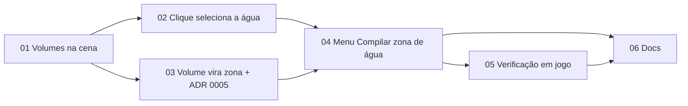

Status: ready-for-agent

# Zona de água a partir do WaterVolume

## Problem Statement

Criar zona de água é uma das tarefas mais difíceis no L2. O servidor trata a água só pela zona `water`, e o `zmax` dela **é** a superfície da água para ele: decide quando o personagem nada, quando começa a perder fôlego e onde a boia de pesca fica (`Zones.java:132-139`, `ValidatePosition.java:104-110`, `FishingSkill.java:68-72`). Uma zona de água desenhada à mão sai com o contorno torto e o topo errado, e o erro só aparece em jogo.

O cliente já tem a resposta exata: cada lago, fosso e fonte é um ator `WaterVolume`, que é um brush convexo com a geometria da água. O usuário quer clicar na água, ver a água selecionada, clicar com o botão direito e escolher **"Compilar zona de água"**. A zona `water` sai dos dados do volume e o XML aparece na janela de XML, como na compilação de hoje.

### O que o app tem hoje e o que falta

Estas causas foram lidas no código; não são suposições.

- **O app não lê volumes.** A "água" de hoje é só material: `walkMaterial` (`internal/scene/material.go:115-127`) marca como `Water` o material translúcido cujo caminho contém "water", e o renderer o desenha no pass Water. Nenhum `WaterVolume` é lido. `MeshActorClasses` (`internal/unreal/actor.go:12-14`) deixa brushes de fora de propósito.
- **O `Hit` não diz o que foi atingido.** `scene.Hit` (`internal/scene/pick.go:28-35`) tem só `Pos`, `Distance` e `Surface`. O `triangleSet` sabe o `Batch`, mas o descarta (`internal/scene/triangles.go:63`).
- **Só zonas e vértices são selecionáveis.** Nenhum objeto da cena pode ser selecionado.
- **Não há menu de contexto.** O botão direito só gira a câmera (`internal/ui/fly.go:50-66`). O único popup é o menu do projeto (`projectMenu`, `internal/ui/projectpanel.go:167-215`).
- **A leitura não alcança o brush.** `ReadModel` (`internal/unreal/level.go:148-210`) lê os nós BSP, mas `VisiblePolygons` filtra superfícies invisíveis. O struct `Scale` (`MainScale`, `PostScale`) é pulado como `KindNone` (`internal/l2pkg/properties.go:238`).
- **O que já serve:** `zone.Water` existe (`internal/zone/zone.go:23`), `Document.Compile(ids)` compila qualquer conjunto de zonas (`internal/zone/document.go:186-217`) e `XMLWindow.Open(files)` mostra qualquer lista de arquivos (`internal/ui/xmlwindow.go:39-53`).

## Medições no cliente real

Feitas com uma sonda descartável sobre os 233 tiles `X_Y.unr` do cliente Fafurion e sobre `water.xml` do datapack Majestic. A sonda e a saída estão em `C:/Workspace/zone-builder-notes/zona-de-agua/00-evidence/`, fora do repositório.

| Fato | Valor |
| --- | --- |
| `WaterVolume` vivos (no `Level.Actors`, sem `bDeleteMe`) | 673, em 201 tiles; 8 em 22_22, 13 em 22_24, 16 em 23_22 |
| Faces BSP por volume | 6 em todos os 673: hexaedros convexos |
| Com `Rotation` gravada | 0 |
| `MainScale` e `PostScale` | `(1, 1, 1)` com `SheerRate 0` em 667; nos outros 6 a sonda não decodificou o índice compacto de 2 bytes |
| Com alguma normal fora dos eixos (parede inclinada) | 19 |
| Com topo inclinado | 6 |
| Volumes que passam do próprio tile | 5 |
| Corpos d'água (volumes do mesmo tile que se tocam com o mesmo topo) | 403; 325 de 1 volume, o maior com 13 |
| Pares de volumes que se cruzam em XY e Z com topos diferentes | 26 (12 em 25_25, 10 em 20_14); em XY só, 117 |
| Superfícies BSP de água voltadas para cima | 399; em 306 das 329 com volume, o Z da superfície é igual ao topo do volume; 70 não têm volume nenhum |
| Shapes do `water.xml` que batem com um volume (caixa XY a ±2) | 129 de 205 |
| `zmin` e `zmax` do datapack menos o do volume, nesses 129 | os 2 em −30 (±0,05) em 119; só o `zmax` em −30 em mais 5; os 10 restantes são ajustes à mão (−46, −22, −1, +2970…) |

**`Model.Points` não serve.** O brush guarda pontos que nenhuma face usa. No `WaterVolume0` de 22_22, a caixa de `Points` vai de x 69.989 a 98.304; a caixa das faces BSP vai de 86.757 a 98.304. Os 129 shapes do datapack batem com a caixa das faces.

**O datapack foi gerado dos volumes.** Os shapes que batem são a caixa XY do volume com `zmin`/`zmax` = Z do cliente − 30, 1 zona por volume: em 22_24, `[22_24_water1…9]`, `[22_24_water12]` e `[22_24_water13]` são 11 dos 13 volumes. Os outros 2 são a fonte (`WaterVolume26`, topo −3746, e `WaterVolume27`, topo −5529), que o datapack ajustou à mão em `[22_24_water10]` e `[22_24_water11]`. Dos 76 shapes que não batem, 15 são o tile inteiro e o resto é ajuste à mão ou outra versão do mapa.

## Solution

1. Sem ferramenta armada, o usuário clica na água. O volume sob o clique e os volumes encostados nele com o mesmo topo (o **corpo d'água**) ficam selecionados: o prisma de cada um aparece destacado em azul e a barra de status diz `Água: 8 volumes · topo −3780 (servidor −3810) · exata`.
2. Ctrl+clique tira ou põe um volume avulso na seleção. Esc ou clique fora da água limpa a seleção.
3. Botão direito sobre a água abre um menu com **"Compilar zona de água"**. Se o clique cai em água fora da seleção, ela é selecionada antes.
4. A ação cria a zona `water` no projeto (1 passo de desfazer), compila só ela e abre a janela de XML com o botão de copiar. A zona fica na lista de zonas, editável e salva no `.zbproj`, como qualquer outra.

## Termos

| Termo | Definição |
| --- | --- |
| Volume de água | Um ator `WaterVolume` vivo do mapa: brush convexo, lido das faces BSP do Model dele, em coordenadas do cliente. |
| Corpo d'água | Volumes de água que se tocam em XY (folga ≤ 1) e têm o mesmo topo (±1). É o que o clique seleciona. |
| Topo | Maior Z das faces do volume. Vira o `zmax` da zona depois do offset de D6. |
| Exata / aproximada | Exata: paredes verticais e topo e fundo horizontais, então o prisma do servidor é o próprio volume. Aproximada: o prisma cobre o volume com sobra (parede inclinada ou topo inclinado). |

## Implementation Decisions

### D1. A fonte é a geometria BSP do brush do `WaterVolume`

- **Volume vivo:** export `WaterVolume` presente em `Level.Actors` e sem `bDeleteMe`. O `bHidden` não conta: volume é invisível em jogo por natureza.
- **Geometria:** os polígonos dos nós BSP do Model apontado pela propriedade `Brush`, **todos**, sem o filtro de `PFNotVisible`. É o que o UE2 usa em tempo de execução para saber se um ponto está no volume (`PointCheck` contra o BSP do brush). **[INFERENCE]** sobre o UE2; confirmado pelos 129 shapes do datapack, que batem com as faces e não com `Points`.
- **Descartadas:**
  - `Model.Points`: tem pontos órfãos (ver Medições).
  - O export `Polys`: é a forma do editor. Exigiria ler o trailer do Model até a referência (`asset_bundle_native.rs:377-466` do UE2-Studio) sem ganho, porque as faces BSP já são o volume.
  - A superfície com material de água: 70 das 399 superfícies não têm volume, a água de static mesh não é BSP e o fundo visto através da água não é água.
- **Transformação do brush** (ABrush, não AActor): `mundo = Location + PostScale · R(Rotation) · MainScale · (v − PrePivot)`, sem `DrawScale`. **[INFERENCE]** do código do UE2; o UE2-Studio não transforma brushes. Nenhum volume real tem rotação ou escala, então a fórmula é verificada só por teste sintético. Um `SheerRate ≠ 0` torna o volume não suportado: ele aparece na cena com o motivo e não é selecionável.

### D2. Leitura: do pacote à cena

| Lugar | Mudança |
| --- | --- |
| `internal/l2pkg` | O struct `Scale` passa a ser lido como lista de propriedades aninhada (`Scale` Vector, `SheerRate` float, `SheerAxis` byte), como `TerrainLayer`. Nos 673 volumes ele vem com tags, não com 17 bytes crus. |
| `internal/unreal` | `ReadBrush(p, i)`: `Location`, `PrePivot`, `Rotation`, `MainScale`, `PostScale`, `Brush`, `bDeleteMe`. `BrushTransform` com a ordem de D1. `Model.Polygons(visit)` visita todos os nós; `VisiblePolygons` vira esse método com o filtro, sem duplicar o laço. |
| `internal/scene` | `Scene.WaterVolumes []WaterVolume`: tile, export, nome, faces (polígonos em coordenadas do cliente, base Unreal), planos, caixa, topo, fundo, `Exact`, `Unsupported`. Lidos no `Load` de cada tile, depois do BSP. O custo é desprezível (até 16 volumes × 6 faces por tile). |

### D3. Seleção pelo clique

- **Raio contra os volumes, não contra a superfície.** `World.PickWater(ray, maxDist)` intersecta o raio com cada volume como poliedro convexo (recorte do raio pelos planos das faces, exato) e devolve o de menor entrada no trecho `[0, maxDist]`. `maxDist` é a distância do `Pick` normal; sem acerto na cena, o raio vai até o far plane.
  - Clicar na superfície, no fundo visto através da água ou numa fonte de static mesh seleciona o volume. Clicar na margem seca não seleciona.
  - Com a câmera dentro do volume, a entrada é 0 e o clique seleciona a água onde a câmera está.
- **Quando:** só no clique esquerdo sem ferramenta armada e fora das alças de vértice. É o caminho em que `zones.click` hoje devolve `""` (`cmd/zonebuilder/zonetool.go:110-113`), então nada que já existe muda.
- **Corpo d'água:** o clique expande a seleção para os volumes conectados (D-Termos), também entre tiles carregados. Ctrl+clique alterna um volume avulso.
- **Destaque:** cada volume vira um `render.ZoneShape` (`internal/render/overlay.go:16-41`) com a pegada, o fundo e o topo do volume passados por `ToServer`. O overlay aplica `FromServer` e o prisma cai exatamente sobre o volume do cliente, sem renderer novo. A cor é a de `zone.Water` em `zone/appearance.go`. Volume aproximado ganha a marca de problema (`Problem`).
- **Estado:** `cmd/zonebuilder/water.go` (novo) guarda a seleção por `(tile, export)`. A troca ou o descarregamento de tile limpa os volumes que sumiram.
- **Status:** `Água: N volumes · topo T (servidor T') · exata|aproximada`. Clicar em água sem volume dá `Esta água não tem WaterVolume no mapa`, que é o caso das 70 superfícies sem volume.

### D4. Menu de contexto

- **Clique direito:** Press com `Buttons == ButtonSecondary` e Release dentro de `clickSlop` (3 px), no mesmo `cursorProbe` (`cmd/zonebuilder/cursor.go:35-57`), que passa a reconhecer os 2 botões. Arrastar com o direito continua girando a câmera. Esquerdo + direito continua sendo o lift.
- **Alvo:** o clique direito faz o mesmo `PickWater` de D3. Água fora da seleção é selecionada antes de o menu abrir; clique direito fora da água não abre menu.
- **Widget:** `ui.ContextMenu`, extraído do `projectMenu` (sink que fecha com qualquer Press, cartão na posição do ponteiro, itens de 220×34 dp com ícone e texto). O `projectMenu` passa a usá-lo, para não manter 2 menus. Fecha com Esc, com clique fora e ao escolher o item. Entra por último no `Shell.Layout`, por cima dos cartões.
- **Item:** "Compilar zona de água", ícone Lucide `droplets`. Desabilitado, com o motivo no status, quando o polígono de outra zona está aberto (`e.drawing`).

### D5. Do volume à zona

Código puro em `internal/water` (novo), sem GL e sem Gio: `Compile(volumes []Volume, existing func(name string) bool) []Plan`. Cada `Plan` é um nome mais os comandos de `zone`.

- **Uma zona por topo.** O servidor usa como superfície o maior `zmax` dos shapes da zona (`Territory.java:20-33`, `Zones.java:132-139`). Volumes com topos diferentes na mesma zona fariam a água baixa respirar pela altura da alta. Os volumes selecionados são agrupados pelo topo já arredondado no Z do servidor.
- **Um polígono por volume.** A pegada é a envoltória convexa XY dos vértices das faces, sem pontos colineares, arredondada para inteiro. Cada polígono leva o próprio `zmin` (fundo) e `zmax` (topo); o servidor testa o Z por shape (`AbstractShape.java:7-9`). Uma caixa dá 4 pontos, como no datapack.
  - **Descartada:** unir os volumes de um topo num polígono só. Exigiria união booleana de polígonos para economizar linhas de XML, e a fronteira comum entre 2 retângulos já é coberta pelo teste `>=`/`<=` de `Polygon.isInside`.
- **Z:** `zmin = round(fundo) + WaterZOffset`, `zmax = round(topo) + WaterZOffset` (D6).
- **Tipo e parâmetros:** `type="water"`, sem `<set>`. Nenhum dos 205 shapes do datapack usa parâmetro.
- **Nome:** `[X_Y_<volume>]`, com o tile e o volume de menor nome (ordem natural) do grupo, por exemplo `[22_22_WaterVolume0]`. É rastreável até o volume e não colide com os nomes do datapack (`[22_22_water1]`), porque o servidor sobrescreve sem aviso a zona de mesmo nome.
- **Repetição:** se o nome já existe no projeto, o plano não cria nada e só compila a zona existente. As edições do usuário nunca são sobrescritas. O status diz `Zona [22_22_WaterVolume0] já existe no projeto: compilada a versão do projeto`.
- **Aplicação** (`cmd/zonebuilder/water.go`): todos os `CreateZone` e `AddShape` dos planos num `zone.Batch`, 1 passo de desfazer. Depois `Document.Compile(ids)` só com essas zonas, sem mexer na seleção de compilação da lista, e `shell.XML.Open(files)`. Um `BlockedError` usa o `blockedStatus` de hoje, e a zona fica no projeto para ser corrigida.

### D6. Offset de Z da água

Os 2 dados se contradizem, e a decisão vai para o **ADR 0005**:

| Fonte | Topo da zona em relação ao topo do volume |
| --- | --- |
| ADR 0003 (chão do servidor = chão do cliente + 32) | +32 |
| `water.xml` do datapack, gerado dos volumes | −30 em 119 dos 129 shapes que batem (e só no `zmax` em mais 5) |

- **Recomendado: −30**, numa constante única `water.ServerZOffset = -30`. A zona compilada se comporta como as ~200 zonas de água que o servidor já carrega: um lago feito no app nada e respira igual ao mar ao lado.
- **Consequência visível:** depois de compilada, a zona aparece no viewport com o topo 62 unidades abaixo da superfície, porque o overlay converte do servidor com +32 (ADR 0003). A seleção de D3 continua sobre o volume. O ADR registra isso para ninguém "corrigir" depois.
- O ticket 05 mede em jogo onde o personagem começa a nadar e a perder fôlego e confirma ou troca a constante.

### D7. Avisos na compilação

Nenhum bloqueia; todos vão para o status e para o log.

| Aviso | Quando |
| --- | --- |
| Aproximada | Algum volume do grupo tem parede ou topo inclinado (19 e 6 no cliente). |
| Água sobreposta | Um volume selecionado cruza em XY e Z outro volume vivo com topo diferente que ficou de fora. O servidor vai usar o maior topo dos dois onde eles se cruzam. |
| Fora do tile | O volume passa do tile dele (5 no cliente). Não muda o XML; avisa que a zona entra no tile vizinho. |

## Tickets

Publicados em `issues/`, um arquivo por ticket, numerados na ordem dos bloqueios. Os tickets 02 e 03 podem correr em paralelo depois do 01.

## Testing Decisions

Cada teste nomeia o bug concreto que pegaria. Não se testa cor, texto de painel nem encaminhamento entre a UI e o documento.

- **Cliente real** (pulado sem `ZB_CLIENT`):
  - 22_22 tem 8 volumes vivos, e a caixa de faces do `WaterVolume0` é x 86.757…98.304, y 152.256…153.600, z −8.778…−3.780. Pega `Points` no lugar das faces, transformação errada ou volume morto lido.
  - Os 11 volumes de topo −3780 de 22_24, compilados, dão 1 zona com 11 polígonos que reproduzem `[22_24_water1…9]`, `[22_24_water12]` e `[22_24_water13]` do datapack: mesma caixa XY e mesmos `zmin`/`zmax`. Os valores ficam no teste, porque o app não lê o datapack. Pega offset, arredondamento ou fundo trocado.
  - A fonte de 22_24 (`WaterVolume26` e `WaterVolume27`, que se encostam com topos diferentes) dá 2 zonas, não 1. Pega o agrupamento por topo.
  - `MainScale` de um volume real decodifica como `(1, 1, 1)` com `SheerRate 0`.
- **Seams sintéticos:**
  - `BrushTransform` com `PrePivot`, `MainScale`, rotação de 90° e `PostScale` não uniforme leva um vértice conhecido ao ponto esperado. Pega a ordem das operações.
  - Raio × poliedro convexo: entra pelo topo, passa ao lado, nasce dentro (entrada 0), raspa uma aresta, e um volume atrás do chão (entrada além de `maxDist`) não é escolhido.
  - Corpo d'água: 3 caixas encostadas com o mesmo topo formam 1 corpo; uma 4ª encostada com outro topo fica fora.
  - Agrupamento por topo: 2 topos dão 2 zonas, e cada polígono mantém o próprio `zmin`.
  - Envoltória: hexaedro com parede inclinada vira pegada convexa sem pontos colineares e marca "aproximada".
  - Nome existente: o plano não cria zona e devolve o ID existente.
  - Os comandos de um plano com 3 volumes são desfeitos com 1 `Undo`.
- **Smoke no app:**
  - 22_22: clicar no mar de Giran, conferir os 8 prismas e o status, clicar com o botão direito, compilar, copiar o XML e conferir 1 zona com 8 polígonos.
  - 22_24: clicar na fonte alta (`WaterVolume26`), Ctrl+clicar na baixa (`WaterVolume27`) e compilar: 2 zonas.
  - 25_25: compilar só o `WaterVolume9` (topo −3788), que é cruzado pelo `WaterVolume7` (topo −3020), e ver o aviso de água sobreposta.
  - Compilar de novo a mesma água: nenhuma zona nova, e o status diz que compilou a versão do projeto.

## Riscos

| Risco | Mitigação |
| --- | --- |
| Offset −30 errado: o servidor acha que o personagem nada antes ou depois do cliente | Constante única e ADR 0005; ticket 05 mede em jogo. |
| Transformação do brush errada em volumes rotacionados ou escalados | Nenhum dos 673 tem; teste sintético da ordem; `SheerRate ≠ 0` recusado com motivo. |
| A zona compilada aparece 62 abaixo da água no viewport e parece erro | ADR 0005 e o status da compilação explicam; a seleção segue desenhando o volume. |
| O datapack já tem uma zona de água no mesmo lugar | Nome diferente, sem sobrescrita silenciosa. O servidor usa o maior `zmax` das duas: o usuário precisa remover a antiga para que a nova valha. O README diz isso. |
| Clique direito curto gira a câmera em até 3 px antes do menu | Aceitável; o mesmo `clickSlop` do clique esquerdo. |
| Água sem volume (70 superfícies, inclusive mar aberto de alguns tiles) | Fora do escopo; o status diz que não há volume. O mar desses tiles é o shape de tile inteiro, que a ferramenta Tile inteiro já faz. |

## Out of Scope

- Água sem `WaterVolume` (superfície decorativa, mar aberto modelado por tile inteiro).
- Ler ou alterar o `water.xml` do datapack; o app continua sem ler XML (`docs/plan.md`).
- Unir polígonos de volumes vizinhos num contorno único.
- Desenhar todos os volumes do mapa (o "mostrar volumes" do UnrealEd).
- Outros volumes (`PhysicsVolume`, `BlockingVolume`) e outros tipos de zona gerados a partir deles.

## Decisões aprovadas

Aprovadas pelo usuário em 2026-10-09, todas na opção recomendada:

1. **Offset de Z (D6):** −30, como o datapack.
2. **O clique seleciona o corpo d'água inteiro (D3)**, com Ctrl+clique para volumes avulsos.
3. **A ação cria a zona no projeto (D5)** antes de compilar.
4. **Ticket 06 sem o 05:** as docs saem com o −30 marcado como pendente da medição em jogo; o ticket 05 fica aberto para o usuário.
