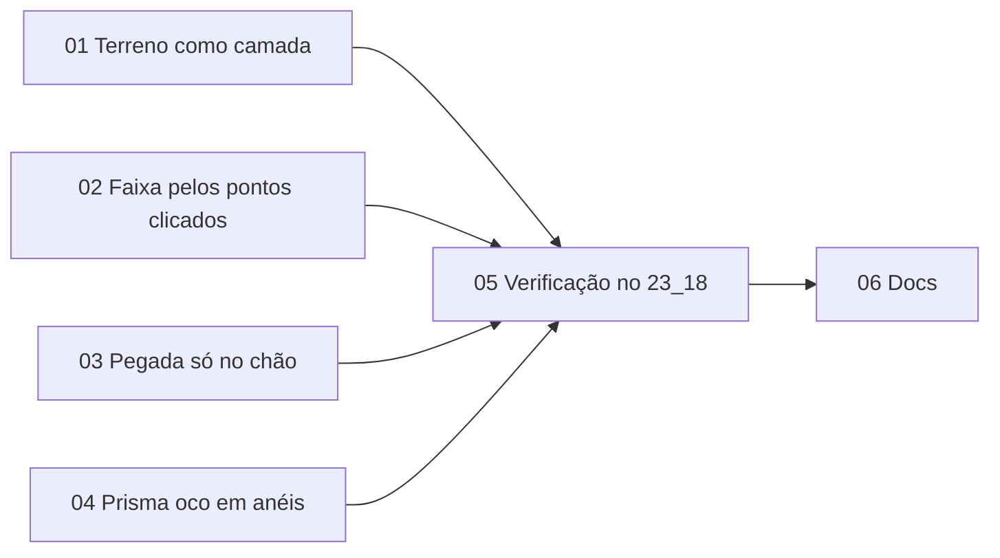

Status: needs-triage

# Zona oca e faixa pelo clique

## Problem Statement

Encontrados no 23_18, ao criar a `[Baium_PvP_Zone]` no topo da torre:

1. **A faixa sempre começa no chão do mapa.** O polígono foi fechado com os 16 vértices no alto da torre (BSP, z ≈ 10.197), mas a zona nasceu com `z −5376 … 10453` "pelo chão da área": desce até o terreno debaixo da torre. Nem toda zona deve começar no chão. Uma zona no alto de uma torre, no andar de cima de um prédio ou numa caverna deve começar na camada onde foi desenhada.
2. **Por dentro, a zona vira uma parede verde.** Com a câmera dentro do prisma, a tela inteira fica tingida e hachurada, e não se enxerga o mapa. No jogo, a zona é desenhada oca: só anéis horizontais empilhados ao longo das paredes, como um muro de linhas, e o interior fica limpo.

### Causas, lidas no código

**Ponto 1: o terreno sempre conta.**

- `coverage.reaches` (`internal/coverage/ground.go`) devolve `true` para qualquer peça de terreno. O alcance de `GroundReach = 1024` só vale para BSP e mesh.
- `floorCoverage.suggest` (`cmd/zonebuilder/suggest.go`) usa `Profile.Fit(vmin, vmax, …)`. Mesmo com `vmin…vmax` no alto da torre, o terreno a −5120 sob o contorno puxa o piso para −5376.
- A mesma regra vale em `Classify`, nos avisos, na régua e nos botões "Piso ao chão" e "Topo ao chão". Para uma zona correta no topo da torre, todos acusariam "chão abaixo do piso".
- Isso está escrito como regra no ADR 0004 ("o terreno sempre conta") e no `GLOSSARY.md` ("O terreno nunca é outra camada").
- Não existe modo de criar um shape só pela altura dos pontos clicados. `zone.SuggestZRange` existe, mas é só o fallback de quando não há chão medido.

**Ponto 2: duas tintas se somam em toda a tela.**

- **Overlay** (`internal/render/overlay.go`, `zoneOverlay.set` e `draw`):
  - cada shape fechado vira prisma sólido, com paredes e as 2 tampas (`triangulate`, piso e topo) em `prismAlpha = 0.22`;
  - uma segunda passada `LESS` (`modeBuriedFace`) desenha em hachura diagonal tudo o que fica atrás da cena.
  - Dentro do prisma, as paredes e as tampas cobrem a tela inteira. Como o mapa está mais perto que elas, todas saem hachuradas.
- **Pegada** (`internal/render/ground.go`, `ground()`):
  - mistura 30% da cor da zona em todo fragmento da cena dentro do contorno e da faixa, e hachura o que fica acima ou abaixo;
  - o fator `up`, que separa superfícies horizontais, só é aplicado às linhas de nível e à grade, não à tinta;
  - por isso as paredes e o teto da torre também são pintados, embora pela definição de **Chão** só contem as faces voltadas para cima.

## Solution

**Ponto 1.** O terreno passa a seguir a regra de camadas, como BSP e mesh: ele conta quando alcança a faixa, ou quando nenhuma outra camada alcança.

- No alto da torre, o terreno sob ela vira "outra camada" e a faixa nasce perto do topo.
- No vale com morro, nada muda.

Além disso, o inspetor ganha uma escolha para shapes novos, **"Faixa nova: pelo chão da área | pelos pontos clicados"**. A segunda opção dá exatamente `vértices ± folga`, sem olhar o chão.

**Ponto 2.**

- **O prisma fica oco:**
  - sem tampas e sem preenchimento;
  - nas paredes, anéis horizontais empilhados em espaçamento regular, como no jogo;
  - as arestas verticais nos vértices e os contornos do piso e do topo continuam.
- **A pegada só pinta chão:** as faces voltadas para cima, vistas de cima. Paredes e tetos ficam com a cor original.

## Termos

| Termo | Definição |
| --- | --- |
| Camada | Sem mudança: cada superfície de chão empilhada numa coluna `x y`. O terreno passa a ser uma camada como as outras para a regra de alcance. |
| Outras camadas | Camadas que não cruzam a faixa nem ficam a até `GroundReach` dela. **Agora inclui o terreno**, quando ele está fora de alcance e alguma camada de BSP ou mesh está dentro. |
| Origem da faixa nova | De onde um shape novo tira `zmin zmax`: **chão da área** (`Profile.Fit`, padrão) ou **pontos clicados** (`zone.SuggestZRange`). |
| Anel | Linha horizontal desenhada na parede do prisma a cada passo de Z, contado a partir do `zmin` do shape. |

## Implementation Decisions

### D1. Terreno como camada, com fallback

Hoje a regra é: terreno sempre conta; BSP e mesh contam quando cruzam a faixa ou ficam a até `GroundReach` dela. A regra nova julga o terreno da faixa como um bloco:

```
terrenoConta(zmin, zmax) =
    span do terreno sob o contorno cruza [zmin − GroundReach, zmax + GroundReach]
    OU nenhuma peça de BSP/mesh (não excluída) alcança [zmin, zmax]
```

- **Por que um bloco só.** O terreno é uma superfície contínua. Se uma parte dele alcança a faixa, todo o terreno sob o contorno é a mesma camada. Isso preserva o caso do vale com um morro de 3000 dentro do retângulo: os cantos estão no terreno, então o terreno alcança e o morro inteiro conta, como hoje.
- **Por que o fallback.** Uma faixa longe de tudo, como num shape criado fora dos tiles e depois aberto, ou numa faixa arrastada para longe, continua sendo ajustada pelo terreno em "Recalcular pelo chão". `TestPeakFarFromTheVerticesSetsTheTop` continua valendo sem mudar a expectativa; só o comentário dele muda, porque o motivo agora é o fallback.
- **Onde vale.** Em `reaches`, ou seja, em `Fit`, `ground`, `others`, `Classify`, no histograma e nos avisos. O julgamento continua sendo feito **uma vez**, a partir da faixa de antes do clique (ADR 0004).
- **Custo.** `Measure` guarda em `Profile` o span do terreno (`terrainLo` e `terrainHi`). "Alguma peça de BSP/mesh alcança" sai de 2 buscas binárias em `byLow`, só com as peças que não são terreno. Para isso, `byLow` passa a ter um índice separado para elas. `Classify` precisa continuar abaixo de 2 ms (ADR 0004), medido com `-fps` em 22_22 e em 23_18.
- **Casos cobertos:**

| Caso | Hoje | Depois |
| --- | --- | --- |
| Polígono no topo da torre (23_18) | −5376 … 10453 | piso perto do topo; o terreno vira outra camada |
| Retângulo no vale com morro de 3000 | morro conta | morro conta (o terreno alcança pelos cantos) |
| Caverna de BSP 3000 abaixo do terreno | o terreno estica o topo até a superfície | o terreno vira outra camada |
| Faixa longe de tudo, "Recalcular pelo chão" | o terreno ajusta | o terreno ajusta (fallback) |
| Andar de prédio 600 acima do terreno | o terreno conta | o terreno conta (dentro do alcance): para pegar só o andar, use D2 |

- **ADR.** Novo ADR 0006, que substitui o parágrafo **Camadas** do ADR 0004. O ADR 0004 ganha uma linha apontando para ele.

### D2. Origem da faixa nova

- **Controle.** No inspetor, seção Edição, logo abaixo de "Folga Z da faixa sugerida": um seletor de 2 opções no mesmo padrão do seletor de Tipo, com setas e o rótulo no meio:
  - **Chão da área** (padrão): o comportamento de hoje, já com a regra de D1.
  - **Pontos clicados:** `zmin = menorZ − folga` e `zmax = maiorZ + folga`, por `zone.SuggestZRange`, sem medir o perfil.
- **Onde vale.** No fechamento do polígono (`zonetool.go`), no retângulo e no círculo, tanto no clique quanto na prévia (`placed`). A prévia continua sendo exatamente o que entra no documento. No modo pontos clicados não há "medindo…", porque nada é medido.
- **Tile inteiro não muda.** Os vértices dele não estão sobre nada (`fromTerrain`), então ele sempre usa o chão da área. O seletor não o afeta, e o rótulo do controle diz "para polígono, retângulo e círculo".
- **Os vértices gerados de retângulo e círculo** continuam caindo no chão perto da altura de desenho (`groundZ` com `ref + groundAbove`). Desenhados no alto da torre, eles caem no topo da torre, não no terreno.
- **Mensagem.** Nova chave `editor.source.vertices`: "pelos pontos clicados" e "by the clicked points". Ela entra no `sourceMessage` como uma nova `zSource` (`zByVertices`).
- **Persistência.** Só na sessão, como a folga hoje (`EditPanel.Margin` também não é salva). Se a escolha precisar sobreviver ao reinício, entra em `project.Config` junto com a folga, numa fatia própria.
- **Shapes que já existem não mudam.** Para a zona da captura, a correção é manual: Base 9941, Altura 512 e "Piso ao chão", que com D1 passa a respeitar a torre.

### D3. A pegada só pinta chão

Em `ground()` (`internal/render/ground.go`), a tinta de dentro da faixa, as hachuras de acima e abaixo e as linhas de nível passam a ser multiplicadas por um fator `floor`:

- `floor = smoothstep(0.3, 0.5, abs(n.z))`, que é o `up` de hoje;
- multiplicado por `step(vPos.z, uEye.z)`, ou seja, só conta com o olho acima do fragmento. Isso separa o piso do teto sem normal de vértice: `cross(dFdx, dFdy)` não tem sinal confiável, e por isso o código atual usa `abs`.

O contorno da zona, desenhado sobre qualquer superfície que ele cruze (`edge`), continua em todas as superfícies, porque é ele que mostra onde a parede encontra o mapa. `uEye` já existe no shader da cena (`scene.go`); falta só expor o uniform ao trecho `groundGLSL`.

### D4. Prisma oco em anéis

**Geometria** (`zoneOverlay.set`):

- As tampas saem: piso e topo deixam de gerar triângulos. As tampas são o único chamador de `triangulate`, que sai junto (não tem teste).
- As paredes continuam como 2 triângulos por aresta, agora com um atributo novo por vértice: o `zmin` do shape em Z do cliente. O shader precisa do Z relativo ao piso; como o offset de 32 do ADR 0003 se cancela na diferença, os anéis caem nos mesmos Z de servidor.
- As linhas não mudam: contorno do piso, contorno do topo, arestas verticais nos vértices e linha do chão nas paredes.

**Shader:**

- Um novo modo de fragmento, `modeWall`, desenha só os anéis e descarta o resto. Não há preenchimento.
- O anel é `|fract((z − zmin) / passo) − 0,5|` medido em pixels com `fwidth`, com 1 px de traço e antialias, no mesmo padrão de `gridLine`.
- **Passo com nível de detalhe:**
  - base de 64 unidades, dobrando (128, 256, …) até os anéis ficarem a pelo menos 6 px um do outro na tela;
  - a passagem de um nível para o seguinte é um esmaecimento, não um salto.
  - Assim, a torre de 15.829 de altura não vira uma parede sólida de linhas de longe, e de perto mostra a grade fina do jogo.
- **Alfa:** 0,55 nos anéis do shape em primeiro plano; o contorno fica opaco, como hoje.

**Passadas** (`zoneOverlay.draw`):

- As faces passam por `modeWall` duas vezes: `GEQUAL`, em que os anéis aparecem inteiros, e `LESS`, em que os anéis atrás da cena saem com 35% do alfa.
- A hachura em tela `modeBuriedFace` sai. Era ela que cobria a tela de diagonais.
- A parte enterrada continua visível, que é o objetivo de D4d da cobertura vertical: aparece como anéis fracos e arestas tracejadas, sem preenchimento.

**Onde vale:**

- zonas e exclusões;
- a prévia do retângulo, do círculo e do polígono fechado;
- os volumes de água (`water.go` usa o mesmo `render.ZoneShape`).

Tudo isso usa um estilo só, sem opção de "sólido". Se faltar leitura de volume ao olhar de fora, a resposta é ajustar o alfa ou o passo, não trazer o preenchimento de volta.

**Por que não gerar os anéis como linhas na CPU:** o passo dependeria da distância da câmera. Isso obrigaria a reconstruir o buffer a cada frame, ou então a fixar um passo que fica denso demais de longe e esparso demais de perto. O shader resolve por pixel, e o buffer só muda quando o documento muda, como hoje.

## Tickets

A quebra está em `issues/`, um arquivo por ticket. 01, 02, 03 e 04 podem começar já.



## Testing Decisions

- **Testes de seam em `coverage`** para D1. Cada teste nomeia o bug que pegaria:
  - **torre:** terreno a 0 e piso de BSP a 15.000 sob o quadrado, com `Fit` a partir de `[14744, 15256]`:
    - a faixa fica em `14744 … 15256`;
    - `Classify` não acusa chão abaixo do piso;
    - o terreno aparece em `Others`.
    - Pega a regra antiga, que puxa o piso até o terreno.
  - **caverna:** terreno a 0 e piso de BSP a −3000, com `Fit` a partir da faixa da caverna: o topo não sobe até o terreno.
  - **morro:** terreno com um pico de 3000 e os cantos a 0, com `Fit` a partir de `[−256, 256]`: o pico ainda define o topo. Pega um terreno julgado peça por peça, em vez de em bloco.
  - **fallback:** `TestPeakFarFromTheVerticesSetsTheTop` continua passando sem mudar a expectativa.
- **D2, D3 e D4** não ganham teste automático: é UI, shader e encaminhamento, e a regra do projeto não testa cor de shader nem encaminhamento. A prova é o smoke no app (ticket 05).
- **Orçamento:** `Classify` com `-fps` em 22_22 e em 23_18, arrastando a seta Z, com p99 abaixo de 2 ms.

## Riscos

| Risco | Mitigação |
| --- | --- |
| D1 tira o terreno de uma zona que precisava dele: zona sobre uma ponte de BSP a menos de 1024 do rio, onde o terreno alcança | Com o terreno ao alcance, nada muda. Ele só sai quando está a mais de 1024 da faixa **e** existe BSP/mesh ao alcance. O aviso "outras camadas" mostra o Z dele. |
| Os pisos internos da torre, a menos de 1024 do topo, ainda puxam o piso no modo chão da área | Esperado pela regra de camadas. O modo pontos clicados (D2) é a saída explícita. |
| Anéis densos demais ou cintilando em paredes quase de perfil | Nível de detalhe por `fwidth` com esmaecimento; o smoke inclui uma parede vista de perfil. |
| Sem preenchimento, fica difícil ler o volume de uma zona pequena vista de longe | O contorno e as arestas verticais continuam opacos e os anéis dão o volume. Se o smoke mostrar que falta, o ajuste é o passo-base ou o alfa. |
| A pegada some de rampas inclinadas além de 60° | É o mesmo limiar do `up` de hoje (`smoothstep 0,3…0,5`). Rampas acima disso já não contam como chão (ADR 0004). |

## Out of Scope

- Ler a geodata do datapack para decidir as camadas.
- Persistir a origem da faixa nova e a folga em `config.json`.
- Mudar a faixa de shapes que já existem quando a regra de D1 entrar em vigor: a regra só age em ajustes e na criação.
- Desenhar anéis no piso e no topo (tampa em grade).

## Decisões em aberto

Os padrões acima já estão aplicados no plano. Confirmar ou trocar antes de implementar:

1. **Padrão da faixa nova:** chão da área (proposto) ou pontos clicados.
2. **Paredes sem preenchimento** (proposto) ou com um véu de cerca de 4% de alfa por trás dos anéis.
3. **Passo-base dos anéis:** 64 (proposto) ou outro valor.
