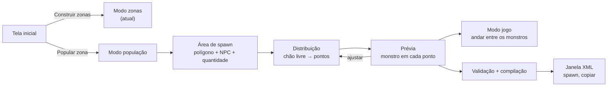

# Popular zona: plano do módulo

Segundo modo de uso do Zone Builder: um assistente que cria spawns de monstros para zonas de farm. O usuário demarca uma área sobre o mapa e informa o NPC e a quantidade. O app distribui os monstros pelo chão livre da área, longe das static meshes, e mostra um monstro embutido em cada ponto, parado ou no modo jogo. Depois que o usuário aprova, ele compila o XML de spawn que o `SpawnParser` do servidor Java lê.

As regras do [plano principal](plan.md) continuam valendo: o app só abre `.unr` e gera XML, não lê o datapack e não altera o servidor Java. O id do NPC, o respawn e o raio de colisão são digitados pelo usuário.

## Fontes de verdade

| Assunto | Fonte |
| --- | --- |
| Formato do XML de spawn (só referência) | `majestic-datapack-main/gameserver/data/spawn/spawn.dtd` e os 102 arquivos `XX_YY.xml` da mesma pasta; exemplos em `22_22.xml:519-562` (mesh de farm), `22_14.xml:22+` (um ponto por spawn) e `22_25.xml:59-70` (os dois misturados) |
| Semântica do XML de spawn | `majestic-java-main/server/.../data/xml/parser/SpawnParser.java` (`readData` L50-128, mesh L160-190), `utils/SpawnMesh.java` (`getRandomLoc`), `utils/Location.java` (`parseLoc` L151-163, `getRandomLoc` L354-356), `model/HardSpawner.java` (L50-69), `model/Spawner.java` (L78-80, L196-212, L233-239), `model/GameObject.java` (`spawnMe0` L158-161), `model/Creature.java` (`spawnMe` L3387-3390) |
| Play Map (física, câmera, controles) | `C:/Workspace/UE2-Studio`: `src/play_map.rs`, `src/app/play_map.rs`, `src/app/play_map/prepare.rs`, `src/scene/play_map.rs`, `src/host_egui/play_map.rs`, `docs/guides/play-map.md` |
| Personagem embutido e formato `UE2HUM01` | `UE2-Studio/src/play_map/avatar.rs`, `src/play_map/avatar/bundle.rs`, `assets/play-map/human.bin`, `assets/play-map/README.md` |
| Leitura de SkeletalMesh e MeshAnimation (referência do port Go do extrator) | `UE2-Studio/crates/animation-engine/src/{skeletal,skin,meshanim,pose}.rs`; `src/unreal/mod.rs` (`skeletal_mesh` L1673, `resolved_material` L1712, `animation_set` L1760, `animation_chunk` L1781); `src/anim/npcgrp.rs` (raio de colisão medido) |

O UE2-Studio é **só leitura**: nenhum arquivo dele é alterado, e nenhum código Rust roda no fluxo. O Zone Builder porta para Go o que precisa, como no plano principal, e copia o `human.bin` sem mudar nenhum byte.

## Fatos que moldam o design

- **Gramática real do spawn:** `<spawn name [event_name]>` com um `<mesh>` opcional de `<vertex x y minz maxz/>` e um ou mais `<npc id count [respawn] [respawn_rand] [respawn_cron] [period_of_day] [pos="x y z [h]"]>`. Não existem `<territory>`, `<add>` nem `<banned_territory>`: o parser deles (`func755`/`func756`) é código morto. Portanto **o spawn não tem exclusões**.
- **Mesh sorteia de novo a cada respawn.** Um `<npc>` sem `pos` usa a última `<mesh>` que veio antes dele. Em todo spawn e respawn, `SpawnMesh.getRandomLoc` sorteia um ponto novo no polígono. O ponto só é aceito se o Z da geodata cair na faixa e as 3×3 células de geodata em volta estiverem abertas (NSWE = 15). O sorteio não usa espaçamento nem raio de colisão, e só desvia de static meshes que a geodata registra.
- **`pos` é um ponto fixo.** `Location.getRandomLoc` devolve o próprio ponto, então o monstro nasce e renasce sempre ali e vagueia até `MaxDriftRange` (200) em volta dele. Nos dados atuais, o estilo de um monstro por spawn é escrito como um `<spawn name="[Area_N]">` por ponto, com `count="1"` e `pos` (`[Den_of_Evil_N]`, `[Stakato_Nest_N]`).
- **O servidor ajusta o Z.** `spawnMe0` faz `z = GeoEngine.getHeight(...)`, até para `pos` fixo. O Z do arquivo só escolhe a camada. O Z vai em coordenadas do servidor (cliente + 32, [ADR 0003](adr/0003-z-do-servidor-32-acima-do-cliente.md)).
- **Heading 0 é ignorado.** `spawnMe` só aplica `h` quando ele é maior que 0. O compilador emite headings em 1..65535.
- **Respawn:** `Rnd.get(respawn − respawn_rand, respawn)` segundos, com `respawn` 60 por padrão. Se `respawn_rand > respawn`, o parser lança exceção.
- **Erros derrubam o arquivo.** Qualquer exceção (falta de `count`, `npc` sem `pos` e sem mesh antes, mesh inválida, `respawn_rand > respawn`) perde o resto do arquivo. Um id de NPC desconhecido gera NPE, que só vai para o log, e esse spawn não nasce **[INFERENCE]**.
- **Grupos:** sem `event_name`, o spawn cai em `ALL` e nasce na subida do servidor. `period_of_day` não tem efeito (`getPeriodOfDay()` não tem chamadores). O compilador não emite nenhum dos dois.
- **Sem reload:** `//reload_spawn` só ressuscita os templates que já estão na memória e não relê o XML. Testar um XML novo exige reiniciar o servidor.
- **Nome do arquivo é livre.** O parser varre `data/spawn/` recursivamente e ignora o nome (`96_96.xml` não é um tile). Um arquivo próprio por projeto evita mexer nos arquivos de tile do datapack.
- **O modelo do monstro vem do cliente, não do servidor.** O XML de NPC do servidor traz `collision_radius` e `collision_height`, mas não traz mesh. O cliente escolhe o modelo pelo id no `Npcgrp.dat`, que é Ver413 (RSA + zlib) e não tem parser em nenhum repositório. Por isso o app embute **um** modelo de prévia e o usa para qualquer id.
- **O monstro de prévia é o `death_knight_wizard_m00`.** No cliente Fafurion, `Animations/LineageMonsters15.ukx` (container Ver111, 132/40) exporta `SkeletalMesh death_knight_wizard_m00` (508.862 bytes) e `MeshAnimation death_knight_wizard_anim` (924.098 bytes), lidos com `zbdump`. Os nomes do pacote incluem a sequência `Wait`. As skins ficam em `SysTextures/LineageMonstersTex9.utx`, grupo `death_knight_wizard`: `FinalBlend death_knight_wizard_t00` e `_t01`, com Shader, Combiner e as texturas `_ori`, `_ori_sp` e `_ori_sp2` por baixo. O cajado aparece separado na pose de referência e deve ir para a mão pela animação **[INFERENCE]**. O datapack não tem esse NPC (só `Death Knight` 20136 e 29007), então o raio de colisão padrão sai da própria mesh, com a regra do `npcgrp.rs`: a mediana da distância horizontal dos vértices.
- **O Play Map do UE2-Studio é uma prévia sem gameplay.** O jogador é uma cápsula vertical (raio 16, altura 80, olho a 64) com gravidade 980, pulo de 360, corrida de 260 (×2 com Shift), voo de 900 sem colisão e sub-passos de até 4 unidades. A colisão empurra a cápsula para fora do triângulo mais penetrado, em até 6 iterações, e só conta como chão uma normal com `n.z > 0,65`. A câmera em terceira pessoa fica 240 atrás do olho, com varredura de esfera que encurta o braço junto a paredes. A colisão usa uma BVH de triângulos com o terreno, o BSP sólido (sem a flag 0x8) e as meshes que bloqueiam (`bCollideActors && bBlockNonZeroExtentTraces && (bBlockActors || bBlockPlayers || bWorldGeometry)`).
- **O personagem do UE2-Studio já é um bundle.** `human.bin` tem 1,4 MB no formato `UE2HUM01`: little-endian com placement, clips já em frames e sem root motion, partes com ossos, inverse bind, vértices com 4 influências, índices, seções com modo de render e skin em PNG RGBA. O humano está na escala do jogo (altura 80). O formato não é específico do humano: serve para qualquer skeletal mesh com clips.
- **O que o Zone Builder já tem:** o chão em coordenadas do servidor (`scene.World.Floor`), o recorte do chão sob um polígono (`coverage.Measure`), ray cast (`World.Pick`, também na vertical em `groundZ`), as AABBs das static meshes (`Scene.Actors[i].Bounds`, `Sections[j].Bounds`) e os volumes de água (`Scene.WaterVolumes`). Faltam: BVH, as flags de colisão dos atores, vértices com normal ou ossos, instancing (`glDrawElementsInstanced` e `glVertexAttribDivisor` não estão nos bindings) e qualquer conceito de tela ou modo (`cmd/zonebuilder/main.go:run` guarda todo o estado do editor em variáveis locais).

## Decisões

### Saída: um ponto fixo por monstro

O que a prévia mostra é o que o servidor faz. Cada ponto aprovado vira um `<spawn>` com 1 `<npc count="1" pos="x y z h">`. Com `<mesh>` + `count`, o servidor sortearia pontos novos a cada respawn sem olhar as static meshes, e a distribuição aprovada seria descartada na primeira subida. O custo é que o monstro sempre renasce no mesmo ponto, como nas zonas `[Den_of_Evil_N]`. O app não oferece a saída `<mesh>`.

### Modelo embutido: extrator Go que grava `UE2HUM01`

O Zone Builder ganha uma CLI offline, `zbmodel`, que lê a mesh, a animação e as skins direto do cliente pelo `internal/l2pkg` e grava um `.bin` no formato `UE2HUM01`. O monstro sai em escala nativa (drawscale 1, ajustável por flag), com os pés em Z = 0 na pose `Wait`, e o root motion é removido como no `Assets::load_client` do UE2-Studio. O app embute o monstro e o `human.bin` com `//go:embed` e decodifica os dois com o mesmo decoder. Em runtime não há leitura de cliente.

O port do leitor de SkeletalMesh e MeshAnimation cobre só o caminho que o cliente Fafurion exercita: pacote 132/40, LOD 0, montagem das wedges do Lineage, até 4 influências por vértice e trilhas de animação. O resto das 4.632 linhas de `skeletal.rs`, `skin.rs`, `meshanim.rs` e `pose.rs` (escrita, PSK/PSA, outras versões) fica de fora. As skins são resolvidas pelo grafo de material que o Go já tem (`internal/unreal`), a partir dos nomes passados ao `zbmodel`.

Alternativa descartada: exportar PSK/PSA pela interface do UE2-Studio e converter em Go. Funciona sem alterar o Rust, mas depende de um passo manual que não se reproduz por linha de comando.

### Render do modelo: skinning na CPU + instancing

Todas as instâncias compartilham uma pose por frame (idle em sincronia). A CPU aplica o skinning uma vez por frame, sobe um VBO e desenha todas as instâncias com uma chamada instanciada. Cada instância passa `x y z yaw` por atributo com divisor 1. Assim a paleta de ossos não esbarra no limite de uniforms do GLES 3.0 (256 vetores garantidos; o UE2-Studio usa 1.024 `mat3x4`). Os bindings ganham `glDrawElementsInstanced` e `glVertexAttribDivisor`, que são core no GLES 3.0. O shader é texturizado com corte em alfa 0,5 e a luz fixa do UE2-Studio (`0,60 + 0,40·max(N·L, 0)`), e roda entre os passes Masked e Translucent.

### Documento: mesmo `.zbproj`, versão 2

`project.Project` ganha `Spawns *spawn.Document` e `Version` passa a 2. Projetos da versão 1 abrem sem spawns. Um binário antigo recusa a versão 2 em vez de apagar os spawns ao salvar. Os tiles, o cliente e a câmera são compartilhados pelos dois modos.

## Fluxo



## Distribuição

A entrada é o polígono da área em coordenadas do servidor, a faixa Z (sugerida pelo chão da área, como nas zonas), a quantidade N, o raio de colisão r (padrão: o medido na mesh do monstro de prévia), o afastamento das meshes a (padrão 32) e a semente. "Folga" e "margem" já têm outro sentido no glossário.

1. **Grade de candidatos.** Células de 16 unidades (1 célula de geodata) sobre a bbox do polígono. Uma célula é candidata quando o centro dela está dentro do polígono a pelo menos r da borda.
2. **Chão da célula.** Um raio vertical desce do `zmax` até o `zmin`. A célula vale o primeiro chão de terreno ou BSP com `n.z ≥ 0,65`, o mesmo limite do Play Map. Chão de static mesh não vale: monstro não nasce em cima de mesh. Também ficam de fora a célula sem chão e a célula cujo chão fica sob o topo de um volume de água.
3. **Obstáculos.** Contam os triângulos das static meshes visíveis (todas, com ou sem flag de colisão) e as faces de BSP que não são chão. Para cada célula livre, a fatia de interesse é `[chão − 16, chão + altura]`, com a altura do monstro de prévia na pose `Wait`. Um triângulo bloqueia a célula quando, recortado nessa fatia, fica a menos de `r + a` do centro dela no plano XY. A AABB de cada ator, expandida por `r + a`, descarta antes os que estão longe. Copa de árvore acima da fatia não bloqueia; tronco, cerca e pedra bloqueiam.
4. **Sorteio.** É o best-candidate de Mitchell sobre as células livres, com um RNG de semente fixa (`math/rand/v2` PCG). Para cada ponto novo, o algoritmo tira k = 20 candidatas e fica com a mais distante dos pontos já escolhidos. O resultado é uma distribuição espalhada sem cara de grade, e a mesma semente gera os mesmos pontos. Dois pontos nunca ficam a menos de 2r um do outro. Se não couberem N pontos, o app gera os que couberem e avisa "cabem K de N".
5. **Ponto final.** `x y` é o centro da célula sorteado dentro dela com a mesma semente, e o Z é o do chão convertido com `scene.ToServer`. O heading é sorteado em 1..65535 com a mesma semente.

"Regerar" troca a semente. O usuário também pode arrastar um ponto (que é reprojetado no chão), apagar e adicionar pontos com clique. Regerar descarta os ajustes manuais, com desfazer.

O inspetor mostra a área de chão livre, o espaçamento médio e o menor espaçamento resultante.

## Estrutura do código

```
cmd/zonebuilder/home.go       tela inicial e troca de modo
cmd/zonebuilder/spawntool.go  editor de áreas e pontos (reusa o desenho de polígono e a edição de vértices)
cmd/zonebuilder/play.go       sessão do modo jogo
cmd/zbmodel/                  CLI offline: cliente → .bin
internal/spawn/               Area, Point, Document (Apply + histórico, como zone.Document), problemas, JSON
internal/placement/           grade de candidatos, chão, obstáculos, best-candidate
internal/spawnxml/            compilação para o XML de spawn
internal/skeletal/            leitura de SkeletalMesh e MeshAnimation 132/40 (só para o zbmodel)
internal/model/               UE2HUM01 (decoder e encoder), amostragem de pose, skinning na CPU
internal/play/                BVH de colisão, cápsula, gravidade, câmera em terceira pessoa
internal/render/              passe de modelos instanciados; bindings de instancing
internal/ui/                  tela inicial, painéis de área e pontos, HUD do modo jogo
assets/models/                monster.bin, human.bin e README com a procedência e o comando do zbmodel
```

## Marcos

A numeração é própria do módulo (P0-P5). Cada marco termina num critério observável, e o próximo só começa com o anterior cumprido.

### P0. Tela inicial e modos

O app abre numa tela com 2 cartões: "Construir zonas" e "Popular zona". Cada cartão tem uma frase do que faz. Um botão "Início" na barra de comandos volta para essa tela. O estado do editor de zonas sai das variáveis locais de `run` para um tipo de modo, e cada modo tem seu painel no inspetor. A seção do mapa (cliente, tile, vizinhos, recentes), o viewport, a câmera e o projeto ficam compartilhados. A flag `-mode zones|populate` pula a tela inicial, para os smoke tests.

**Pronto quando:** o app abre na tela inicial; "Construir zonas" leva ao editor de hoje sem nenhuma diferença de comportamento; "Popular zona" abre o viewport com a seção do mapa e o painel vazio de áreas; e ir e voltar entre os modos mantém os tiles abertos, a câmera e o projeto.

### P1. Área de spawn e documento

- Modelo de área: nome, polígono (`zone.Shape` com `zmin zmax`), id do NPC, quantidade, `respawn` (padrão 60), `respawn_rand` (padrão 0), raio de colisão, afastamento das meshes, semente e pontos `{x y z heading}` em coordenadas do servidor.
- Ferramentas: polígono, retângulo e círculo (convertido em polígono), reusando `zoneEditor` e a edição de vértices; desfazer e refazer.
- Lista de áreas e painel de propriedades.
- `.zbproj` versão 2.
- Problemas que bloqueiam a compilação: polígono com menos de 3 vértices ou com auto-interseção, id ≤ 0, quantidade < 1, `respawn_rand > respawn`, nome vazio ou repetido, coordenadas fora do mundo e pontos desatualizados (polígono ou parâmetros mudaram depois da geração).

**Pronto quando:** 2 áreas são criadas só com o mouse e o teclado; salvar, fechar e reabrir devolve as 2 idênticas; e um `.zbproj` da versão 1 abre com as zonas intactas e sem áreas.

### P2. Distribuição

O algoritmo da seção Distribuição. Em edição, cada ponto aparece como pino com o círculo do raio de colisão no chão; o ponto selecionado tem alça de arraste. Os avisos "cabem K de N" e "área sem chão livre" não bloqueiam a compilação.

**Pronto quando:** na área da captura de referência (campo entre árvores, pedra e cercas), 50 pontos ficam todos dentro do polígono, nenhum a menos de `r + a` de tronco, cerca ou pedra, nenhum sobre mesh ou água, e nenhum par a menos de 2r; e gerar 2 vezes com a mesma semente dá os mesmos pontos. Testes: ponto na borda do polígono, mesh logo fora da borda bloqueando por dentro, copa acima da fatia que não bloqueia, faixa Z com 2 camadas (ponte) que escolhe a camada certa, e área pequena demais para N.

### P3. Compilação do XML de spawn

- Cabeçalho `<?xml version="1.0" encoding="utf-8"?>`, `<!DOCTYPE list SYSTEM "spawn.dtd">` e `<list>`, com indentação de tab.
- Um `<spawn name="[<nome>_<i>]">` por ponto, com `<npc id count="1" respawn [respawn_rand] pos="x y z h" />`. `respawn_rand` só aparece quando é maior que 0. Tudo em inteiros.
- Sem `event_name`, `period_of_day` nem `<mesh>`.
- Um arquivo por projeto com nome livre (padrão: nome do projeto), na mesma janela de XML com o botão de copiar.
- Compilar 2 vezes dá bytes idênticos.

**Pronto quando:** o XML de um projeto com 3 áreas é carregado por um harness do `SpawnParser`, no mesmo molde de `zone-builder-notes/zoneparser-harness`, sem exceção; e, depois de reiniciar o servidor com o arquivo em `data/spawn/`, os monstros estão nos pontos da prévia (o `//pos` ao lado de 3 deles fica a menos de 16 unidades) e virados para o heading mostrado.

### P4. Monstro embutido e prévia

- **Extração:** o `zbmodel` lê `LineageMonsters15.death_knight_wizard_m00`, `LineageMonsters15.death_knight_wizard_anim` e as skins `LineageMonstersTex9.death_knight_wizard.death_knight_wizard_t00` e `_t01`. Ele grava `assets/models/monster.bin` com o clip `Wait` e imprime o raio e a altura medidos, que viram as constantes do monstro de prévia. Ler o `human.bin` com o mesmo decoder e regravá-lo com o encoder Go deve dar os mesmos bytes, o que prova que o formato foi portado sem perda.
- **App:** amostragem de pose (`sample_track` e `compose` do `pose.rs`), skinning na CPU e o passe instanciado. O botão flutuante "Prévia" troca os pinos pelo monstro em cada ponto, girado pelo heading (o heading do L2 e o yaw do Unreal usam a mesma unidade, 65536 = 360° **[INFERENCE]**, a confirmar no P3).

**Pronto quando:** com a prévia ligada, cada ponto mostra o death knight wizard em `Wait`, com os pés no chão, o cajado na mão e virado para o heading; a pose de referência fica igual à captura do UE2-Studio (mesh, cajado e as 2 skins); e 500 instâncias mantêm 60 fps no hardware do M4.

### P5. Modo jogo

- Port do Play Map: BVH com terreno, BSP sólido e meshes que bloqueiam (as flags `bCollideActors`, `bBlockActors`, `bBlockPlayers`, `bWorldGeometry` e `bBlockNonZeroExtentTraces` passam a ser lidas, com o padrão da classe); cápsula, gravidade, pulo, corrida, voo e câmera em terceira pessoa com as mesmas constantes; o humano do `human.bin` com idle, corrida, queda e pulo, e transição de 0,2 s.
- O botão flutuante "Jogar" fica no viewport dos **dois modos** e começa no chão sob o centro da tela. No modo população, os monstros da prévia ficam visíveis e sem colisão; no modo zonas, o overlay das zonas continua desenhado. Esc volta para a câmera de edição na posição de antes.
- Controles: WASD, Shift, Espaço, F (voo), V (primeira ou terceira pessoa). O olhar é por arraste do mouse, como no voo de hoje: o Gio não tem captura relativa do ponteiro **[INFERENCE]**, a confirmar antes de portar o `confine` do UE2-Studio.

**Pronto quando:** na área da captura, o personagem anda entre os monstros, é barrado pelas cercas, pela pedra e pelos troncos, sobe rampas de terreno até o limite de inclinação e pula; a proporção entre o humano e o monstro bate com o jogo; e, no modo zonas, dá para entrar e sair do modo jogo dentro de uma zona sem perder a seleção nem o histórico de desfazer.

## Fora do escopo

- Ler o `Npcgrp.dat` ou qualquer `.dat` do cliente para mostrar o modelo certo de cada id. A prévia sempre usa o death knight wizard.
- Qualquer mudança no UE2-Studio.
- Ler o datapack: o id, o respawn e o raio são digitados; o app não valida se o id existe.
- Exclusões no spawn (o servidor não tem), `event_name`, `respawn_cron`, `ai_params` e rotas.
- Ler, importar ou editar spawns que já estão no datapack.
- Geodata: o app não lê `geodata/*.l2j`. Um ponto livre no cliente pode cair numa célula que a geodata bloqueia; com `pos` fixo, o servidor nasce o monstro ali mesmo assim.
- Gameplay no modo jogo: combate, IA, movimento dos monstros e colisão com eles.
- Animações além do idle no monstro, e fases diferentes por instância.
