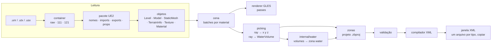

# Zone Builder: plano do projeto

App desktop em Go + Gio para demarcar zonas do servidor Lineage 2 diretamente sobre o mapa do cliente (`.unr`) renderizado em 3D e compilar as demarcações para o XML que o servidor Java espera. O app só abre `.unr` e gera XML: não lê o datapack nem altera o servidor Java.

O segundo modo de uso, **Popular zona** (assistente de spawn de monstros para zonas de farm), tem plano próprio em [plan-populacao.md](plan-populacao.md).

O problema que resolve: hoje as zonas são gravadas andando com o personagem (`//zone_panel` em `AdminZoneBuilder.java`), o que não alcança todos os cantos, sempre emite `peace_zone`, grava um Z por ponto e despeja o XML no console do servidor. No Zone Builder, cada ponto vem de um clique no viewport (ray cast contra terreno, BSP e static meshes), em qualquer lugar do mapa.

## Fontes de verdade

| Assunto | Fonte |
| --- | --- |
| Abrir e renderizar `.unr` | `C:/Workspace/UE2-Studio` (Rust): `crates/package-engine`, `crates/texture-engine`, `crates/static-mesh-engine`, `src/unreal/mod.rs`, `src/unreal/objects.rs`, `src/unreal/visual.rs`, `src/scene.rs`, `src/gpu.rs`, `docs/formats/client-versions.md`, `docs/formats/material-objects.md` |
| Formato do XML (só referência, o app não lê) | `majestic-datapack-main/gameserver/data/zone/zone.dtd` e os 20 arquivos em `data/zone/` |
| Semântica do XML (quem consome; só referência, o app não altera) | `majestic-java-main/server/.../data/xml/parser/ZoneParser.java`, `templates/ZoneTemplate.java`, `model/Zone.java` (enum `ZoneType`, L655-679), `model/Territory.java`, `commons/.../geometry/Polygon.java`, `model/World.java` (L786-800) |

O Zone Builder porta a lógica de leitura do UE2-Studio para Go; ele não chama o código Rust. Nenhum crate do UE2-Studio expõe C ABI (todos são `dylib` com ABI Rust), e o caminho de leitura é pequeno e puro (bytes → structs), então portar sai mais barato que manter uma ponte cgo.

## Fatos que moldam o design

- **Coordenadas: sem conversão.** O espaço Unreal do mapa é o espaço de mundo do servidor. O tile `X_Y.unr` cobre `[(X-20)·32768, (Y-18)·32768]` mais um tile de 32768 em cada eixo, a mesma fórmula do `World.java` (`MAP_MIN_X = (GeoFirstX-20)<<15`). Um clique no viewport vira `<coords loc="x y zmin zmax"/>` só com arredondamento para inteiro. Que o Z também bate 1:1 é **[INFERENCE]**, a confirmar no M2.
- **Containers suportados pelo UE2-Studio:** pacote cru (magic `C1 83 2A 9E`), `Lineage2Ver111` (XOR `0xAC`) e `Lineage2Ver121` (XOR com o byte baixo da soma do nome do arquivo em minúsculas, com recuperação da chave pelo magic). Pares ArVer/licensee medidos: 117/0 a 133/40. **Não existe** código para 120, 211/212 (Blowfish) nem 411-414 (RSA + zlib).
- **Texturas:** o UE2-Studio decodifica DXT1/3/5, RGBA8 (gravado como BGRA) e G16 (heightmap). P8 + Palette não é decodificado.
- **Shapes que o servidor entende:** `polygon`, `rectangle` (2 cantos), `circle` (`loc="cx cy r [zmin zmax]"`) e as exclusões `banned_polygon`, `banned_rectangle`, `banned_cicrcle` (com o erro de digitação mesmo). O território é a união dos shapes incluídos menos a união dos banidos.
- **Bug do servidor:** `Circle.isInside` é sempre verdadeiro, então um círculo vira na prática o quadrado `c ± r`. O Zone Builder não emite `circle`; a ferramenta de círculo gera um polígono.
- **Z por polígono, não por ponto:** o parser aplica o `zmin zmax` da última `coords` ao polígono inteiro. O compilador emite o mesmo par em todos os vértices.
- **Validação do servidor é fraca:** um polígono inválido só gera log e é carregado mesmo assim; um `type` desconhecido ou um número mal formado derruba o resto do arquivo; um nome duplicado sobrescreve outra zona sem aviso. O Zone Builder valida antes de compilar.
- **Sem reload de zonas em runtime:** testar exige reiniciar o servidor. `//zone_visualize` desenha um polígono no cliente com `ExServerPrimitive` e serve para conferência pontual.
- **Água vem do `WaterVolume`, não do material.** O servidor só conhece a água pela zona `water`. O app lê os atores `WaterVolume` vivos (`Level.Actors`, sem `bDeleteMe`) e a geometria de cada um são **todas** as faces BSP do Model apontado por `Brush`, sem o filtro de `PFNotVisible`; `Model.Points` tem pontos órfãos e não serve. O struct `Scale` (`MainScale`, `PostScale`) vem como lista de propriedades aninhada. A transformação é a do ABrush, não a do AActor: `Location + PostScale · R(Rotation) · MainScale · (v − PrePivot)`, sem `DrawScale`; `SheerRate ≠ 0` torna o volume não suportado. No cliente Fafurion são 674 volumes vivos, todos hexaedros, nenhum rotacionado ou escalado. O Z da zona é o do volume − 30 (`water.ServerZOffset`, [ADR 0005](adr/0005-agua-30-abaixo-do-volume.md), pendente da medição em jogo), não o +32 do ADR 0003.

## Decisões de arquitetura

### Renderização: Gio com `CustomRenderer` + ANGLE (GLES 3.0)

O Gio não tem API 3D pública. O caminho oficial para misturar 3D próprio com a UI do Gio é `app.Window` com `app.CustomRenderer(true)`: o app recebe o `app.ViewEvent` (HWND no Windows), cria o contexto EGL e desenha a cena; depois `gpu.New(gpu.OpenGL{ES: true, Shared: true})` desenha os painéis do Gio por cima no mesmo frame (exemplo `gioui.org/example/opengl`).

- No Windows, o Gio carrega OpenGL via ANGLE (`libEGL.dll`, `libGLESv2.dll`). O app distribui essas duas DLLs ao lado do executável; elas ficam versionadas em `third_party/angle` (licença BSD), com versão e hashes no README da pasta.
- As chamadas EGL/GLES saem por `syscall.NewLazyDLL`, do mesmo jeito que o Gio faz internamente, sem cgo e sem precisar de toolchain C.
- O viewport 3D ocupa a janela inteira e desenha com `glViewport`/`glScissor` na área do widget de viewport; os eventos de ponteiro dessa área chegam pelo `event.Op` do Gio.
- A interface flutua sobre a cena em cartões translúcidos: marca e dock de ferramentas à esquerda, barra de comandos no topo, inspetor à direita, barra de status embaixo e as janelas de altura e de XML. Cada cartão fica com os eventos de ponteiro sobre a própria área, então o clique só chega à cena fora deles. Os ícones são SVGs do Lucide (licença ISC) desenhados como caminhos do Gio por `internal/ui/icon`, e o texto usa Inter (licença SIL OFL), embutida em `internal/ui/fonts`.

Alternativa descartada: renderizar num FBO e copiar para `paint.ImageOp` a cada frame. Funciona, mas copia cerca de 8 MB por frame a 1080p e soma um frame de latência ao arrastar vértices.

Riscos que o M0 precisa eliminar:
- **Profundidade:** o UE2-Studio usa Z reverso com Depth32F. GLES 3.0 não tem `glClipControl`; ver se o ANGLE expõe `GL_EXT_clip_control`. Se não expuser, usar profundidade padrão com near plane maior ou depth logarítmico no shader.
- **Texturas comprimidas:** subir DXT nativo exige `GL_EXT_texture_compression_s3tc` (o ANGLE sobre D3D11 costuma expor). Sem a extensão, decodificar para RGBA8 na CPU, como faz o UE2-Studio.

### Projeto de trabalho + compilação

- O documento de trabalho é um arquivo de projeto JSON (`*.zbproj`). Ele guarda caminho do cliente, tiles abertos e as zonas, inclusive rascunhos inválidos (polígono com 2 pontos, nome repetido, campo obrigatório vazio), além de cor e visibilidade.
- **Compilar** transforma as zonas válidas em XML e mostra cada arquivo numa janela, com um botão para copiar; o app não grava XML em disco. Zona com erro bloqueia a compilação e aparece na lista de problemas, com clique levando até ela.
- O projeto é a única entrada de zonas. O app não lê XML de zona; as regras de leitura do `ZoneParser` só decidem o que o compilador emite.

### Fluxo



### Estrutura do código

```
cmd/zonebuilder/        main: janela, loop de eventos
cmd/zbdump/             CLI: abre pacotes e lista exports; usado na varredura do corpus
internal/l2pkg/         container (raw/111/121), reader, compact index, header, tabelas, propriedades, resolução de imports entre pacotes
internal/texture/       mips, decodificação DXT1/3/5, RGBA8, G16, P8+Palette
internal/unreal/        Level, Model (BSP), StaticMesh, TerrainInfo, atores, grafo de material (Shader/FinalBlend/Combiner → Texture)
internal/scene/         construção de malha (grid do terreno, fan do BSP, transform dos atores), batches, filtros, picking
internal/render/        bindings EGL/GLES via ANGLE, shaders, passes, upload de textura, overlay de zonas
internal/camera/        câmera fly, ray a partir do cursor
internal/zone/          modelo de zona, geometria (simple polygon, point-in-polygon), validação, tipos e parâmetros chave/valor
internal/zonexml/       compilação para XML
internal/water/         WaterVolume → planos da zona water (1 zona por topo, 1 polígono por volume, avisos)
internal/project/       leitura e gravação do .zbproj
internal/ui/            painéis Gio: zonas, propriedades, ferramentas, problemas, status
```

## Marcos

Cada marco termina num critério observável. O próximo marco só começa com o anterior cumprido.

### M0. Spike de renderização

Janela Gio com `CustomRenderer`, contexto EGL via ANGLE, um cubo texturizado girando dentro de um widget de viewport, com um painel lateral do Gio ao lado e um botão por cima.

**Pronto quando:** redimensionar a janela mantém cubo e painel corretos; o clique no viewport chega ao código do viewport e o clique no botão chega ao Gio; a profundidade escolhida está decidida e registrada em ADR (Z reverso ou alternativa); DXT nativo ou decodificação na CPU está decidido e registrado em ADR.

### M1. Leitura de pacotes

Port de `package-engine` (somente leitura): container, header, nomes, imports, exports, compact index, propriedades com tag (inclusive o preâmbulo `RF_HAS_STACK`), `skip_material_data` com as faixas de licensee, `TLazyArray`, e resolução de import entre pacotes procurando em `Maps/unr`, `StaticMeshes/usx`, `Textures/utx`, `SysTextures/utx`, `System/u`. A CLI `zbdump` lista os exports de qualquer pacote.

**Pronto quando:** `zbdump` varre **todos** os `.unr`, `.utx` e `.usx` do cliente Majestic World sem nenhum erro de leitura, e o número de exports de cada pacote bate com o UE2-Studio numa amostra de 1 mapa, 1 `.utx` e 1 `.usx`.

### M2. Geometria do mapa e picking

Port do terreno (heightmap G16, `TerrainScale`, `QuadVisibilityBitmap`, `EdgeTurnBitmap`, fallback por `MapX/MapY`), do BSP (fan por nó, flags `PF_*`, UVs) e dos atores de static mesh (`StaticMeshActor`, `MovableStaticMeshActor`, `L2MovableStaticMeshActor`, `Mover`, `L2NMover`, transform com `Location - PrePivot`, quaternion GLM-euler, `DrawScale3D·DrawScale`). Filtros `exceeds_region_tile` e `is_off_map`. Rebase das coordenadas em torno do centro da cena. Câmera fly com os mesmos controles do UE2-Studio (WASD, Q/E, Shift, arrastar para olhar, roda). Picking: DDA no grid do terreno e Möller–Trumbore com early-out por AABB para BSP e meshes. Barra de status com a posição de mundo do cursor.

**Pronto quando:** um tile de cidade (por exemplo Giran) abre sem textura com terreno, BSP e meshes no lugar; o clique devolve `x y z`; e o `//pos` dentro do jogo, num ponto reconhecível (uma escada, um portão), fica a menos de 16 unidades (1 célula de geodata) do valor do clique, confirmando o Z 1:1.

### M3. Texturização

Port do `texture-engine` (mips, DXT1/3/5, RGBA8 BGRA→RGBA, G16) mais P8+Palette, que o UE2-Studio não tem. Grafo de material até 8 níveis (Shader, FinalBlend, Combiner, modificadores) até a primeira Texture; `Skins[i]` do ator tem prioridade sobre `Materials[i]` da mesh. Camadas do terreno: camada 0 opaca, as seguintes em blend alfa com a máscara no canal R do alpha map, depth `>=` sem escrita, UV por camada com rotação, pan e escala. Passes na ordem do UE2-Studio: Opaque → Masked (corte em alfa 0,5) → TerrainLayer → Translucent → Brighten → Modulated → Additive → Water → Overlay. Mipmaps, repeat e filtro anisotrópico. Cache de textura por pacote.

**Pronto quando:** o mesmo tile do M2 fica visualmente igual ao modo Textured do UE2-Studio na mesma posição de câmera (comparação lado a lado de 3 vistas: terreno aberto, interior com BSP e área densa de meshes), sem material rosa/fallback onde o UE2-Studio desenha textura.

### M4. Vários tiles e desempenho

Abrir um tile com os vizinhos (até 3×3), carregando em goroutines e subindo para a GPU na thread do contexto. Frustum culling por batch, com batches divididos por setor do tile para o culling ter efeito. Limite de memória com descarte dos tiles mais distantes.

**Pronto quando:** abrir 3×3 tiles em torno de Giran mantém pelo menos 60 fps com a câmera parada e voando, em hardware a definir pelo usuário; e uma zona que cruza a borda entre 2 tiles pode ser demarcada sem trocar de mapa.

### M5. Ferramentas de demarcação

Modelo de zona: nome, tipo, parâmetros `set`, shapes incluídos, shapes banidos, `restart_point`, `PKrestart_point`.

Ferramentas no viewport:
- **Polígono:** cada clique adiciona um vértice no ponto atingido; Enter ou clique no primeiro vértice fecha.
- **Retângulo:** 2 cliques em cantos opostos.
- **Círculo:** centro + raio, convertido em polígono de N lados.
- **Exclusão:** as mesmas ferramentas criam `banned_polygon` dentro da zona selecionada.
- **Ponto de restart:** clique grava `x y z`.
- **Edição:** arrastar vértice (com reprojeção no chão), inserir vértice no meio de uma aresta, apagar vértice, mover o shape inteiro.
- **Faixa Z:** sugerida pelo menor e maior Z dos vértices com folga configurável (padrão ±256, igual ao `AdminZoneBuilder`) e editável no painel; um atalho "encostar no chão" recalcula a partir do terreno e das meshes.
- **Desfazer/refazer** para toda edição.

Overlay: prisma translúcido entre `zmin` e `zmax`, arestas desenhadas por cima da cena e vértices com alça; cor por tipo de zona.

Chão: o shader da cena desenha a grade das células do terreno nas superfícies voltadas para cima e marca a pegada da zona selecionada. O chão dentro do contorno e da faixa Z fica tingido; dentro do contorno e fora da faixa fica hachurado; as exclusões abrem buracos. O contorno é desenhado sobre o que ele cruza. O comprimento das arestas aparece em etiquetas no viewport.

**Pronto quando:** uma zona com 1 polígono, 1 exclusão e 2 pontos de restart é criada só com o mouse; cada vértice cai no chão visível sob o cursor, inclusive em cima de telhados e dentro de interiores BSP; e desfazer volta cada passo.

### M6. Ver e gerenciar demarcações

- **Lista de zonas:** busca por nome, filtro por tipo, mostrar/ocultar por zona e por tipo, contagem de problemas; selecionar leva a câmera até a zona.
- **Painel de propriedades:** nome; tipo (lista fechada com os 23 valores do enum, respeitando maiúsculas); parâmetros chave/valor, só para os que o servidor exige (`residence`, `distribution_id`, `fishing_place_type`) ou que scripts leem. A lista tipada dos parâmetros do `ZoneTemplate` foi removida: o foco do app são as coordenadas.
- **Duplicar zona** para criar variações sem redesenhar.
- **Painel de problemas** atualizado a cada edição.
- **Cobertura vertical da zona selecionada** (ver [ADR 0004](adr/0004-chao-medido-e-avisos-sem-bloqueio.md) e o README): o chão sob o contorno é medido sobre os triângulos e mostrado sem depender do botão Chão. Chão acima do topo e abaixo do piso em hachuras diferentes, linhas onde o chão cruza o piso e o topo, a linha do chão em cada parede, o prisma enterrado tracejado, pinos no pior ponto com a folga, números por shape e da zona no inspetor e uma régua com histograma na janela de altura. Arrastar a faixa só reclassifica, no mesmo frame.

**Pronto quando:** com 3 zonas de tipos diferentes no projeto, a busca, o filtro por tipo e o mostrar/ocultar afetam a lista e o viewport como esperado; selecionar uma zona leva a câmera até ela; e salvar, fechar e reabrir o `.zbproj` devolve as zonas idênticas.

### M7. Validação e compilação para XML

Regras (cada uma vira item no painel de problemas):
- Polígono com pelo menos 3 vértices e simples. A checagem cobre todos os pares de arestas não adjacentes, mais rígida que o `Polygon.validate` do servidor, que pula a aresta 0→1.
- Sem vértices consecutivos repetidos; o primeiro vértice não se repete no fim.
- Retângulo com exatamente 2 cantos.
- `zmin <= zmax` em todo shape.
- Pelo menos 1 shape incluído por zona.
- `type` dentro do enum, com a caixa exata.
- Nome único no projeto. O app não conhece as zonas do datapack: evitar colisão com nomes existentes (o servidor sobrescreve sem avisar) fica com o usuário, por exemplo com um prefixo próprio.
- `RESIDENCE` com nome `residence_<id>`; `FISHING` com `distribution_id` e `fishing_place_type`; `SIEGE`/`HEADQUARTER` com `residence`.
- Coordenadas dentro de X ∈ [−163840, 229375] e Y ∈ [−262144, 294911].

Avisos de chão (cobertura vertical, [ADR 0004](adr/0004-chao-medido-e-avisos-sem-bloqueio.md)): chão acima do topo, chão abaixo do piso, folga apertada e área sem chão medido. Aparecem no painel de problemas com ícone próprio, levam ao pior ponto com um clique e **não bloqueiam** a compilação. A faixa Z sugerida na criação e os botões "Recalcular pelo chão", "Piso ao chão" e "Topo ao chão" usam o chão da área inteira, com a regra das camadas.

Compilador:
- Cabeçalho `<?xml version='1.0' encoding='utf-8'?>` + `<!DOCTYPE list SYSTEM "zone.dtd">` + `<list>`.
- Indentação com tab.
- `<set name="k" val="v" />`, sempre `val`.
- Polígono com coords de 4 números, o mesmo `zmin zmax` em todos os vértices.
- Exclusões como `banned_polygon`.
- Nunca emite `circle`.
- Inclui só as zonas selecionadas ou marcadas para exportação.

**Pronto quando:** o XML compilado de um projeto com 1 zona de cada um dos 23 tipos é carregado pelo `ZoneParser` do servidor, sem nenhuma alteração no Java, sem nenhuma linha `invalid territory data`, `Empty territory` ou exceção; e `//zone_check` em 3 pontos de teste (dentro, fora e dentro da exclusão) responde conforme o desenho.

### M8. Containers 41x (condicional)

Blowfish (211/212) e RSA + zlib (411-414), a partir das referências públicas do esquema `l2encdec`, para abrir clientes que o UE2-Studio não abre. Só entra se a decisão em aberto 1 pedir.

**Pronto quando:** `zbdump` varre sem erro todos os pacotes de 1 cliente 41x indicado pelo usuário.

## Fora do escopo

- Editar ou salvar `.unr` e qualquer escrita em pacote.
- Gerar geodata.
- Reload de zonas no servidor em runtime.
- Iluminação (lightmaps, vertex colors), emitters e sons: o modo Textured do UE2-Studio também não usa iluminação. Skeletal meshes só entram como modelo embutido do módulo Popular zona ([plan-populacao.md](plan-populacao.md)).
- Ler, mostrar, importar ou editar zonas que já existem no datapack. O datapack só serviu de referência para entender o formato.
- Qualquer mudança no servidor Java, inclusive no `//zone_panel` e no bug do `Circle.isInside`.
- `domains.xml` e `restart_points.xml`. O XML de spawn é do módulo Popular zona ([plan-populacao.md](plan-populacao.md)).

## Testes

Seguindo a regra de testar só o que tem um bug concreto para pegar:
- **Leitura de pacote:** varredura do corpus do cliente pelo `zbdump`, com o caminho do cliente vindo de uma variável de ambiente; o teste é pulado quando ela não existe. Pega quebra de gate de versão/licensee.
- **Compact index, propriedades e DXT:** casos de bytes reais tirados do cliente, em especial as bordas que o UE2-Studio já mediu (`skip_material_data`, Ver121 renomeado).
- **Geometria de zona:** polígono com auto-interseção na aresta 0→1 (o caso que o servidor deixa passar), ponto na borda horizontal, exclusão.
- **Compilação:** todas as coords de um polígono compilado trazem o mesmo `zmin zmax`; compilar 2 vezes gera bytes idênticos; e o teste de aceitação do M7 contra o servidor de verdade.

## Decisões em aberto

1. **Versões de cliente.** "Todas as versões como o UE2-Studio" hoje significa raw, Ver111 e Ver121, com ArVer 117-133. Algum cliente alvo usa container 41x (Blowfish/RSA)? Se sim, o M8 entra no escopo; se não, fica de fora.
2. **Agrupamento da saída.** Um arquivo por tipo (padrão atual do datapack) ou um arquivo por projeto.
3. **Plataforma.** O plano assume só Windows (ANGLE + HWND). Linux mudaria a camada EGL (EGL do sistema em vez de ANGLE).
